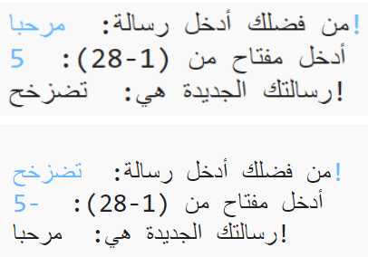

## المقدمة:

في هذا المشروع، ستتعلم كيف تنشئ برنامج التشفير الخاص بك لتبادل إرسال الرسائل السرية واستلامها مع صديق. يرتبط هذا المشروع بالنشاط "Earth to Principa" في الصفحة 16 من كتاب Space Diary (يوميات فضائية).

<div class="trinket">
  <iframe src="https://trinket.io/embed/python/402256078c?outputOnly=true&start=result" width="600" height="500" frameborder="0" marginwidth="0" marginheight="0" allowfullscreen>
  </iframe>
  
</div>

### معلومات إضافية لقادة النادي

إذا كنت بحاجة إلى طباعة هذا المشروع، فيُرجى استخدام [نسخة سهلة الطباعة](https://projects.raspberrypi.org/en/projects/secret-messages/print).


--- collapse ---
---
title: ملاحظات قادة النادي
---


## المقدمة:
في هذا المشروع، سيتعلم الأطفال كيف ينشئون برنامج تشفير لتبادل إرسال الرسائل السرية واستلامها مع صديق. يتناول هذا المشروع تكرار سلسلة نصية.

## الموارد المتوفرة على الإنترنت

__يستخدم هذا المشروع Python 3.__ نوصي باستخدام [trinket](https://trinket.io/) لكتابة Python على الإنترنت. يحتوي هذا المشروع على Trinket التالية:

+ [New (blank) Python Trinket -- jumpto.cc/python-new](http://jumpto.cc/python-new)

وهناك أيضًا trinket تحتوي على المشروع المكتمل:

+ [مشروع 'رسائل سرية' مُكتمل -- trinket.io/python/402256078c](https://trinket.io/python/402256078c)

+ [تحدي 'حاسبة الصداقة' مُكتمل -- trinket.io/python/2e852cd687](https://trinket.io/python/2e852cd687)

## الموارد المتوفرة دون اتصال بالإنترنت
يمكن أن يكون هذا المشروع [مكتمل دون اتصال بالإنترنت] (https://www.codeclubprojects.org/en-GB/resources/python-working-offline/) إذا كنت تفضل ذلك.

يمكنك العثور على المشروع المكتمل في قسم "موارد المتطوعين"، الذي يحتوي على:

+ messages-finished/messages.py
+ messages-finished/friends.py

(جميع الموارد المذكورة أعلاه قابلة للتنزيل أيضًا كملفات `.zip` للمشاريع والمتطوعين).

## أهداف التعلم
+ تكرار متغير سلسلة نصية؛
+ أسلوب الدالة `()find`؛
+ عامل القيمة المطلقة (`%`).

يتناول هذا المشروع عناصر من الصفوف التالية من [المناهج الرقمية الخاصة بـ Raspberry Pi](http://rpf.io/curriculum):

+ [دمج الإنشاءات البرمجية لحل مشكلة].(https://www.raspberrypi.org/curriculum/programming/builder)

## التحديات:
+ استخدم شفرة قيصر - تشفير الأحرف والكلمات وفك تشفيرها يدويًا؛
+ مفاتيح المتغيرات - السماح للمستخدم بإدخال مفتاح من اختياره؛
+ تشفير الرسائل وفك تشفيرها - تشفير الرسائل ككل وفك تشفيرها؛
+ حاسبة الصداقة - تطبيق تكرار النص على مسألة جديدة.

## الأسئلة الشائعة
+ عند البحث باستخدام `()find` أو `if char in alphabet:`، انتبه إلى أن عمليات البحث تكون حساسة لحالة الأحرف. يمكن أن يستخدم الأطفال:

	python```
	message = input("Please enter a message to encrypt: ").lower()
	```

	ليكون الإدخال بالأحرف الصغيرة قبل إجراء عملية البحث.

--- /collapse ---


--- collapse ---
---
title: مواد المشروع
---
## موارد المشروع
* [ملف .zip يحتوي على جميع موارد المشروع](resources/secret-messages-project-resources.zip)
* [Python Trinket فارغة متصلة بالإنترنت](http://jumpto.cc/python-new)
* [ملف Python فارغ متوفر دون اتصال بالإنترنت](resources/new-new.py)

## موارد قادة النادي
* [ملف .zip يحتوي على جميع موارد المشاريع المكتملة](resources/secret-messages-volunteer-resources.zip)
* [مشروع Trinket المكتمل على الإنترنت](https://trinket.io/python/402256078c)
* [secret-messages-finished/messages.py](resources/secret-messages-finished-messages.py)
* [تحدي 'حاسبة الصداقة' المكتمل على الإنترنت](https://trinket.io/python/2e852cd687)
* [تحدي 'حاسبة الصداقة' المكتمل دون اتصال بالإنترنت](resources/friendship-calculator-finished-friends.py)

--- /collapse ---
