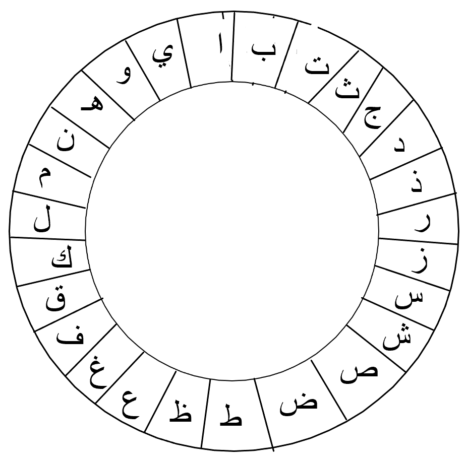
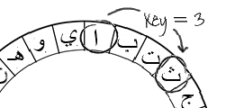

## شفرة قيصر

الشفرة هى نوع من الرموز السرية، حيث يتم تبديل الحروف بحروف أخرى بحيث لا يستطيع أحد قراءة الرسالة.

سوف تستخدم واحدة من أقدم وأشهر الشفرات، وهي **شفرة قيصر**، التي سميت على اسم يوليوس قيصر.

قبل أن نبدأ كتابة التعليمة البرمجية، دعونا نحاول استخدام شفرة قيصر لإخفاء كلمة. ملحوظة: سوف يتم استخدام الابجدية العربية.

+ إخفاء كلمة يسمى **تشفير**.
    
    لنبدأ بتشفير حرف 'الالف'. للقيام بذلك، يمكننا رسم الحروف الأبجدية في دائرة، هكذا:
    
    

+ لإنشاء حرف سري مشفر من حرف عادي، يجب أن يكون لديك مفتاح سري. دعونا نستخدم الرقم 3 كمفتاح (ولكن يمكنك استخدام أي رقم غيره).
    
    **لتشفير** الحرف 'ا' ، فقط تحرك ثلاثة أحرف في اتجاه عقارب الساعة ، والذي سيعطيك الحرف 'ث':
    
    

+ يمكنك استخدام ما تعلمته لتشفير كلمة بأكملها. على سبيل المثال، تشفير كلمة "مرحبا" هو "اشذجث". جربها بنفسك.
    
    + م + 3 = **ا**
    + ر + 3 = **ش**
    + ح + 3 = **ذ**
    + ب+ 3 = **ج**
    + ا + 3 = **ث**

+ إعادة النص إلى حالته الطبيعية يسمى** فك التشفير**. لفك تشفير كلمة، فقط قم بطرح المفتاح بدلاً من جمعه:
    
    + ا - 3 = **م**
    + ش - 3 = **ر**
    + ذ - 3 = **ح**
    + ج - 3 = **ب**
    + ث - 3 = **ا**