## تشفير الحروف

لنكتب برنامج Python لتشفير حرف واحد.

+ افتح الTrinket الذي يحتوي على قالب Python فارغ: <a href="http://jumpto.cc/python-new" target="_blank">jumpto.cc/python-new</a>.

+ بدلاً من رسم الحروف الأبجدية في دائرة، لنكتبها كمتغير `alphabet`.
    
    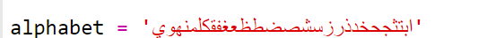

+ كل حرف من الحروف الأبجدية له موضع ، بدءاً من الموضع 0. لذا فإن الحرف 'ا' يكون عند الموضع 0 من الأبجدية ، و 'ت' عند الموضع 2.
    
    

+ يمكنك الحصول على حرف من المتغير `alphabet` عن طريق كتابة الموضع بين قوسين مربعين.
    
    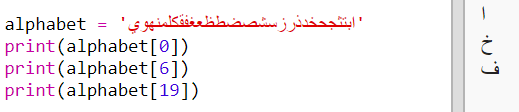
    
    يمكنك حذف عبارات `print` بعد أن تنتهى من تجربة هذا.

+ بعد ذلك، ستحتاج إلى تخزين المفتاح السري `key` في متغير.
    
    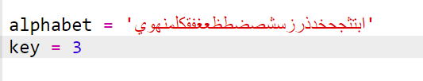

+ ثم بعدها، اطلب من المستخدم ادخال حرف واحد (يسمى `character`) لتشفيره.
    
    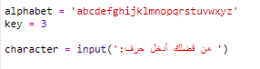

+ ابحث عن الموضع `position` الخاص ب`character`.
    
    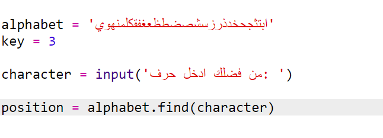

+ يمكنك اختبار `position` المخزن عن طريق طباعته. على سبيل المثال، الحرف 'ج' يكون عند الموضع 4 في الأبجدية.
    
    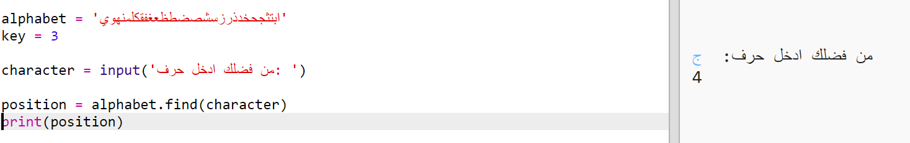

+ لتشفير `character`، يجب عليك ان تجمع `key` و `position`. ثم يتم تخزين ذلك في متغير `newPosition`.
    
    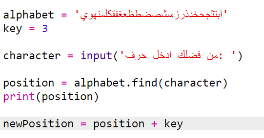

+ أضف تعليمات برمجية لطباعة موضع الحرف الجديد.
    
    

+ اختبرالتعليمات البرمجية الجديدة. لأن `key` الخاص بك هو 3، يجب أن تضيف 3 إلى `position` وتقوم بتخزينه فى المتغير `newPosition`.
    
    على سبيل المثال، الحرف 'ج' يكون عند الموضع 4. للتشفير، ستضيف `key` (و هو 3) مما سيعطى 7.
    
    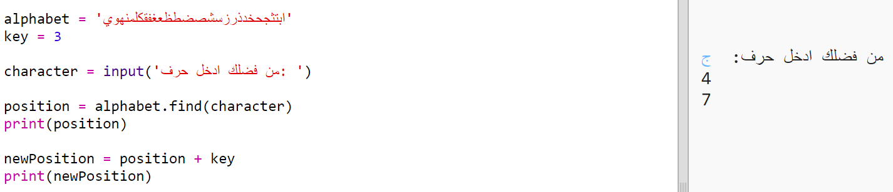

+ ماذا يحدث عند محاولة تشفير الحرف 'و'؟
    
    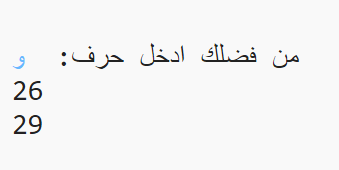
    
    لاحظ أن `newPosition` أصبح 30، و لكن ليس هناك 30 حرف في الأبجدية العربية!

+ يمكنك استخدام المعامل `%` لإخبار الموضع الجديد بالعودة إلى الموضع 0 عند وصوله للموضع ٢٧.
    
    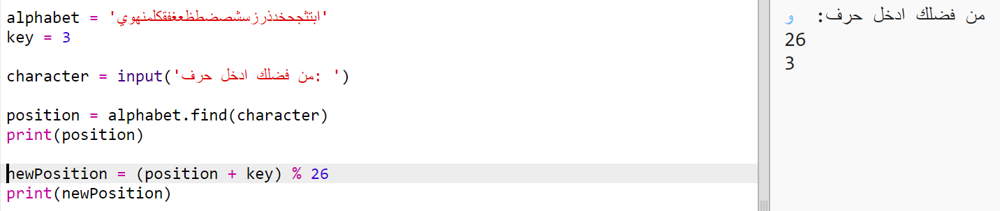

+ أخيرًا، ستحتاج لطباعة الحرف الموجود عند الموضع الجديد.
    
    على سبيل المثال، إضافة المفتاح إلى الحرف 'ج' يعطي 7، والحرف الموجود عند الموضع 7 من الأبجدية هو 'خ'.
    
    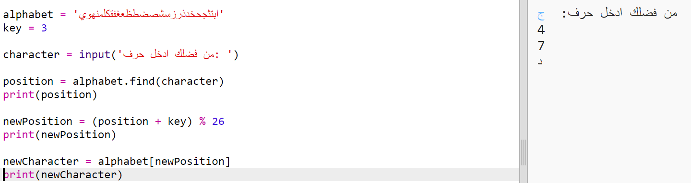

+ جرب تعليماتك البرمجية. يمكنك أيضًا حذف بعض عبارات الطباعة و القيام بطباعة الحرف الجديد فقط في النهاية.
    
    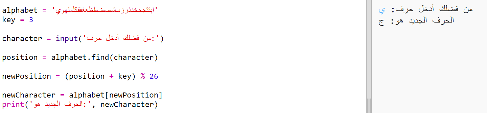