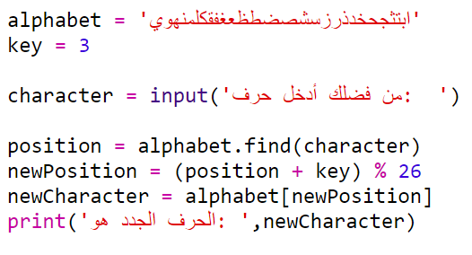
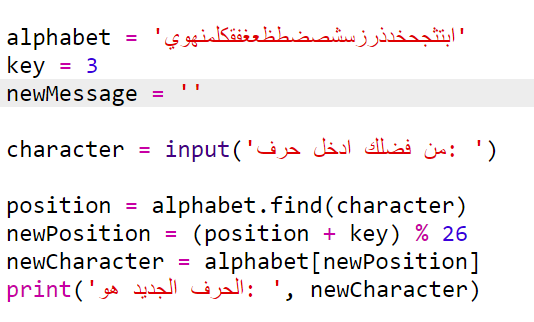
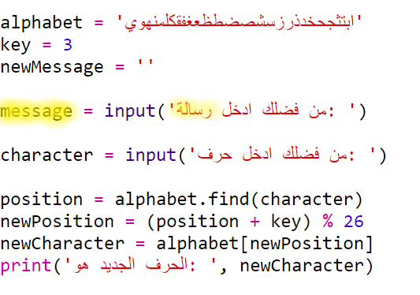
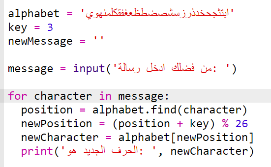
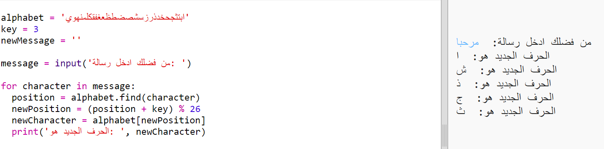
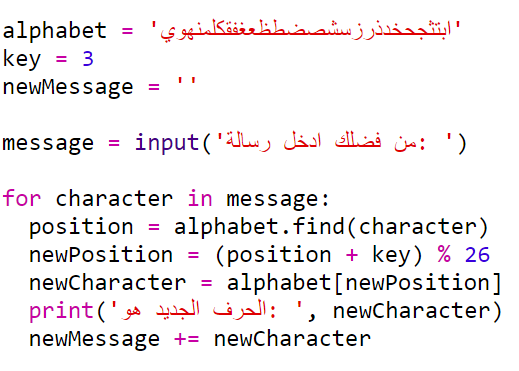
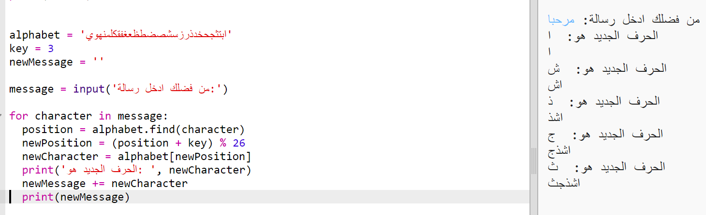
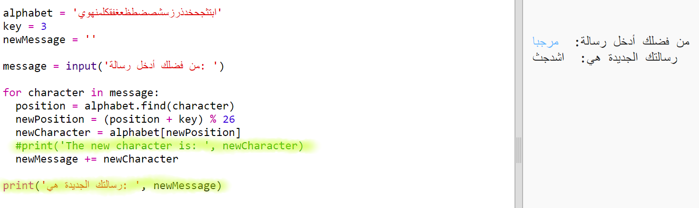

## تشفير الرسائل ككل

بدلًا من مجرد تشفير الرسائل وفك تشفيرها حرفًا بحرف في كل مرة، لنغيِّر البرنامج لتشفير الرسائل ككل!

+ أولًا، تأكد من التعليمات البرمجية بالشكل التالي:

	

+ أنشئ متغيرًا لتخزين الرسالة الجديدة المشفرة.

	

+ غيِّر التعليمات البرمجية لتخزين رسالة المستخدم بدلًا من تخزين حرف واحد.

	

+ أضف حلقة `for` إلى تعليماتك البرمجية، وأضف مسافة بادئة قبل باقي التعليمات البرمجية بحيث تتكرر مع كل حرف في الرسالة.

	

+ اختبر التعليمة البرمجية. سترى أن كل حرف في الرسالة قد تم تشفيره وطباعته على حدة.

	

+ لنضِف كل حرف مشفَّر إلى المتغير `newMessage`.

	

+ يمكنك استخدام `print` لطباعة `newMessage` أثناء تشفيرها.

	

+ إذا قمتَ بحذف المسافات الموجودة قبل عبارة `print`، فستظهر رسالتك المشفَّرة مرة واحدة فقط في النهاية. ويمكنك أيضًا حذف التعليمة البرمجية الخاصة بطباعة مواضع الأحرف.

	

