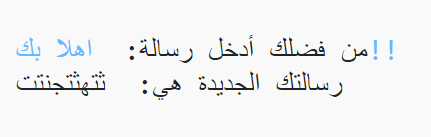
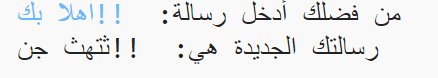

## أحرف إضافية

بعض الأحرف ليست موجودة في الأحرف الأبجدية، ويؤدي ذلك إلى حدوث خطأ.

+ اختبر تعليماتك البرمجية بإدخال بعض الأحرف غير الموجودة في الأحرف الأبجدية.

	على سبيل المثال، يمكنك استخدام الرسالة `!!hi there`.

	

	لاحظ أن أحرف المسافة و`!` تحوَّلت كلها إلى 'c' عند تشفيرها!

+ لإصلاح ذلك، ستحتاج فقط إلى تحويل الحرف إذا كان في الأحرف الأبجدية. ولتفعل ذلك، أضف عبارة `if` إلى تعليماتك البرمجية، ثم أضف مسافة بادئة قبل باقي التعليمات البرمجية.

	

+ اختبر تعليماتك البرمجية مع الرسالة نفسها. ماذا حدث في هذه المرة؟

	

	أصبحت التعليمات البرمجية الآن تتخطى أي حرف ليس موجودًا في الأحرف الأبجدية.

+ إذا لم تقم التعليمات البرمجية بتشفير أي حرف غير موجود في الأحرف الأبجدية واستخدمت الحرف الأصلي فحسب لكان ذلك أفضل.

	أضف عبارة `else` إلى تعليماتك البرمجية لإضافة الحرف الأصلي فقط إلى الرسالة المشفرة.

	

+ اختبر التعليمة البرمجية. سترى أن أي حرف موجود في الأحرف الأبجدية قد تم تشفيره، وأن أي أحرف أخرى تُركت كما هي!

	

