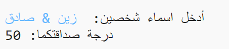
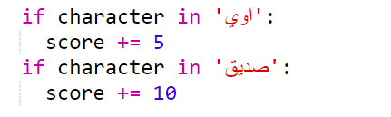
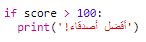

--- challenge ---

## التحدي: حاسبة الصداقة

اكتب برنامجًا لإظهار مدى توافق الأشخاص ، عن طريق حساب درجة الصداقة.

يمكن للبرنامج المرور عبر كل حرف من الأحرف في الاسمين وإضافة نقاط إلى متغير `score` في كل مرة يتم العثور على حرف معين.

يجب أن تقرر قواعد منح النقاط. على سبيل المثال، يمكنك منح نقاط لأحرف العلة (الالف والواو والياء) أو الأحرف الموجودة في كلمة "صديق":

يمكنك أيضًا إعطاء المستخدم رسالة شخصية ، بناءً على نقاطه:

--- challenge/ ---

***
تمت ترجمة هذا المشروع بواسطة متطوعين:

Mustafa Ashraf

نادية علي قاسم

بفضل المتطوعين ، يمكننا إعطاء الناس في جميع أنحاء العالم فرصة للتعلم بلغتهم الخاصة. يمكنك مساعدتنا في الوصول إلى المزيد من الأشخاص من خلال التطوع للترجمة - مزيد من المعلومات على [rpf.io/translate](https://rpf.io/translate).