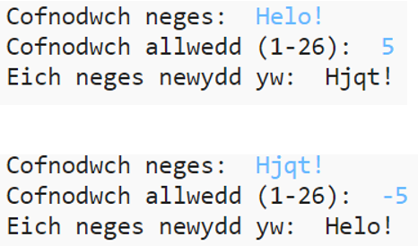

## Cyflwyniad:

Yn y prosiect hwn, byddwch chi'n dysgu sut i wneud eich rhaglen amgryptio eich hun, i anfon a derbyn negeseuon cyfrinachol gyda ffrind. This project ties in with the "Earth to Principia" activity on page 16 of the Space Diary.

<div class="trinket">
  <iframe src="https://trinket.io/embed/python/402256078c?outputOnly=true&start=result" width="600" height="500" frameborder="0" marginwidth="0" marginheight="0" allowfullscreen>
  </iframe>
  
</div>

### Gwybodaeth ychwanegol ar gyfer arweinwyr clwb

Os oes angen i chi argraffu'r prosiect hwn, defnyddiwch y [fersiwn hwylus i'w argraffu](https://projects.raspberrypi.org/en/projects/secret-messages/print).

## \--- collapse \---

## title: Nodiadau arweinwyr clwb

## Cyflwyniad:

Yn y prosiect hwn, bydd plant yn dysgu sut i wneud rhaglen amgryptio, i anfon a derbyn negeseuon cyfrinachol gyda ffrind. Mae'r prosiect hwn yn cyflwyno ailadrodd (dolennu) dros linyn testun.

## Adnoddau Ar-lein

**Mae'r prosiect hwn yn defnyddio Python 3.** Rydym yn argymell defnyddio [trinket](https://trinket.io/) i ysgrifennu Python ar-lein. Mae'r prosiect hwn yn cynnwys y Trinkets canlynol:

* [Python Trinket newydd (gwag) -- jumpto.cc/python-new](http://jumpto.cc/python-new)

Mae hefyd trinket sy'n cynnwys y prosiect a gwblhawyd:

* ['Negeseuon Secret' wedi'i gwblhau - trinket.io/python/402256078c](https://trinket.io/python/402256078c)

* ['Cyfrifiannell Cyfeillgarwch' wedi'i gwblhau - trinket.io/python/2e852cd687](https://trinket.io/python/2e852cd687)

## Adnoddau All-lein

Gall y prosiect hwn gael ei [gwblhau all-lein](https://www.codeclubprojects.org/en-GB/resources/python-working-offline/) os yw'n well gennych.

Gallwch hefyd ddod o hyd i fersiwn wedi'i chwblhau o'r prosiect hwn yn yr adran 'Adnoddau Gwirfoddolwyr', sy'n cynnwys:

* messages-finished/messages.py
* messages-finished/friends.py

(Mae'r holl adnoddau uchod hefyd yn lawrlwythadwy fel prosiect a ffeiliau `.zip` gwirfoddolwyr.)

## Amcanion Dysgu

* Ailadrodd (dolennu) dros newidyn llinyn;
* Y dull `find()` (darganfod);
* Y gweithredwr modws (`%`).

Mae’r prosiect hwn yn cwmpasu elfennau o’r ffrydiau canlynol o [Gwricwlwm Creu Digidol Raspberry Pi](http://rpf.io/curriculum):

* [Cyfuno lluniadau rhaglennu i ddatrys problem.](https://www.raspberrypi.org/curriculum/programming/builder)

## Heriau

* Defnyddio seiffr Cesar - amgryptio a dadgryptio llythrennau a geiriau â llaw;
* Allweddi amrywiol - gan ganiatáu i'r defnyddiwr fewnbynnu allwedd ddewisol;
* Amgryptio a dadgryptio negeseuon - amgryptio a dadgryptio negeseuon cyfan;
* Cyfrifiannell cyfeillgarwch - cymhwyso ailadrodd testun i broblem newydd.

## Cwestiynau a Ofynnir yn Aml

* Wrth chwilio gan ddefnyddio `find()` (darganfod) neu `if char in alphabet:` (os yw'r llythyren yn yr wyddor), nodwch fod chwiliadau yn sensitif i briflythrennau a llythrennau bach. Gall plant ddefnyddio:
    
    ```python
    message = input ("Rhowch neges i amgryptio:").lower ()
    ```
    
    i fewnbynnu llythrennau bach cyn chwilio.

\--- /collapse \---

## \---collapse\---

## title: Deunyddiau prosiect

## Adnoddau'r prosiect

* [.zip ffeil sy'n cynnwys holl adnoddau'r prosiect](resources/secret-messages-project-resources.zip)
* [Trinket Python gwag ar-lein](http://jumpto.cc/python-new)
* [Ffeil wag Python all-lein](resources/new-new.py)

## Adnoddau arweinwyr clwb

* [.zip ffeil sy'n cynnwys holl adnoddau'r prosiect wedi'u cwblhau](resources/secret-messages-volunteer-resources.zip)
* [Prosiect Trinket wedi'i gwblhau ar-lein](https://trinket.io/python/402256078c)
* [secret-messages-finished/messages.py](resources/secret-messages-finished-messages.py)
* [Her 'cyfrifiannell cyfeillgarwch' wedi'i chwblhau ar-lein](https://trinket.io/python/2e852cd687)
* [her 'cyfrifiannell Cyfeillgarwch' wedi'i chwblhau all-lein](resources/friendship-calculator-finished-friends.py)

\--- /collapse \---