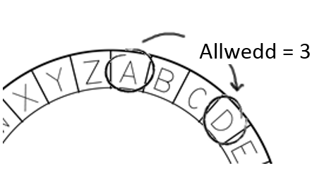

## Seiffr Cesar

Mae seiffr yn fath o god cyfrinachol, lle rydych chi'n cyfnewid y llythrennau fel na all neb ddarllen eich neges.

Byddwch chi'n defnyddio un o'r seiffrau hynaf a mwyaf enwog, y **seiffr Cesar**, a enwyd ar ôl Iŵl Cesar.

Cyn i ni ddechrau codio, gadewch i ni geisio defnyddio seiffr Cesar i guddio gair.

+ Mae cuddio gair yn cael ei alw'n **amgryptio**.
    
    Gadewch i ni ddechrau wrth amgryptio y llythyren 'a'. I wneud hyn, gallwn dynnu llun yr wyddor mewn cylch, fel hyn:
    
    

+ I wneud llythyren gyfrinachol wedi'i hamgryptio o un arferol, mae angen i chi gael allwedd gyfrinachol. Gadewch i ni ddefnyddio'r rhif 3 fel yr allwedd (ond gallwch ddefnyddio unrhyw rif rydych chi'n ei hoffi).
    
    I **amgryptio** y llythyren 'a', rydych chi ddim ond yn symud 3 llythyren gyda'r cloc, a fydd yn rhoi'r llythyren 'd' i chi:
    
    

+ Gallwch ddefnyddio'r hyn rydych chi wedi'i ddysgu i amgryptio gair cyfan. Er enghraifft, 'hello' wedi'i amgryptio yw 'khoor'. Rhowch gynnig arni'ch hun.
    
    + h + 3 = **k**
    + e + 3 = **h**
    + l + 3 = **o**
    + l + 3 = **o**
    + o + 3 = **r**

+ Mae cael testun yn ôl i'r arferol yn cael ei alw'n **dadgryptio**. I ddadgryptio gair, tynnwch yr allwedd yn hytrach nag ychwanegu ato:
    
    + k - 3 = **h**
    + h - 3 = **e**
    + o - 3 = **l**
    + o - 3 = **l**
    + r - 3 = **o**