## Amgryptio llythrennau

Gadewch i ni ysgrifennu rhaglen Python i amgryptio un llythyren.

+ Agorwch y templed Python gwag Trinket: <a href="http://jumpto.cc/python-new" target="_blank">jumpto.cc/python-new</a>.

+ Yn lle tynnu llun o'r wyddor mewn cylch, gadewch i ni ei hysgrifennu fel newidyn `wyddor`.
    
    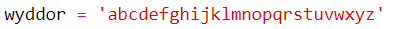

+ Mae gan bob llythyren o'r wyddor safle, gan ddechrau yn safle 0. Felly mae'r llythyren 'a' yn safle 0 o'r wyddor, ac mae 'c' yn safle 2.
    
    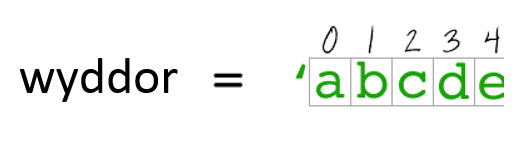

+ Gallwch gael llythyren gan eich newidyn o'r `wyddor` trwy ysgrifennu'r safle mewn cromfachau sgwâr.
    
    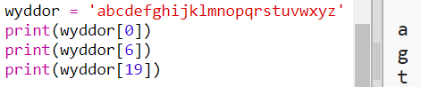
    
    You can delete the `print` statements once you've tried this out.

+ Nesaf, bydd angen i chi storio'r `allwedd` gyfrinachol mewn newidyn.
    
    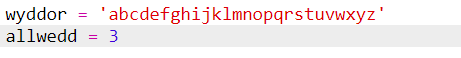

+ Nesaf, gofynnwch i'r defnyddiwr am un llythyren (a elwir yn `gymeriad`) i'w hamgryptio.
    
    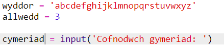

+ Canfyddwch `safle` y `cymeriad`.
    
    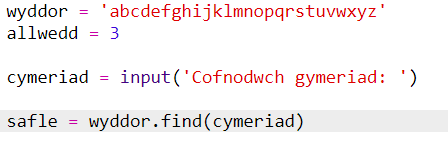

+ Gallwch brofi'r `safle` wedi ei storio trwy ei argraffu. Er enghraifft, mae'r cymeriad 'e' yn safle 4 yn yr wyddor.
    
    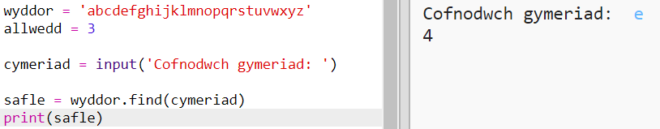

+ I amgryptio'r `cymeriad`, dylech ychwanegu'r `allwedd` i'r `safle`. Yna caiff hyn ei storio mewn newidyn `safle newydd`.
    
    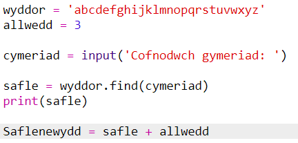

+ Ychwanegwch god i argraffu safle newydd y cymeriad.
    
    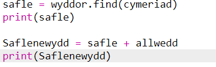

+ Profwch eich cod newydd. Gan fod eich `allwedd` yn 3, dylai ychwanegu 3 i'r `safle` a'i storio yn eich newidyn `safle newydd`.
    
    Er enghraifft, mae'r llythyren 'e' yn safle 4. I'w hamgryptio, rydych chi'n ychwanegu'r `allwedd` (3), gan roi 7.
    
    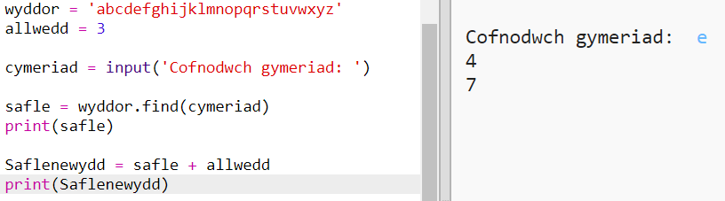

+ Beth sy'n digwydd pan fyddwch chi'n ceisio amgryptio'r llythyren 'y'?
    
    
    
    Sylwch sut mae'r `safle newydd` yn 27, ac nid oes 27 o lythrennau yn yr wyddor!

+ Gallwch chi ddefnyddio `%` i ddweud wrth y safle newydd i fynd yn ôl i safle 0 unwaith y bydd yn cyrraedd safle 26.
    
    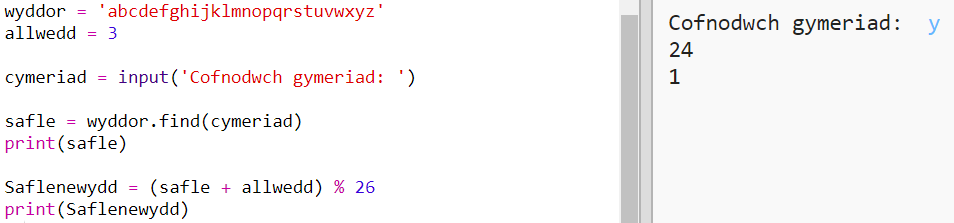

+ Yn olaf, rydych am argraffu'r llythyren yn y safle newydd.
    
    Er enghraifft, mae ychwanegu'r allwedd i'r llythyren 'e' yn rhoi 7, ac mae'r llythyren yn safle 7 yr wyddor yn 'h'.
    
    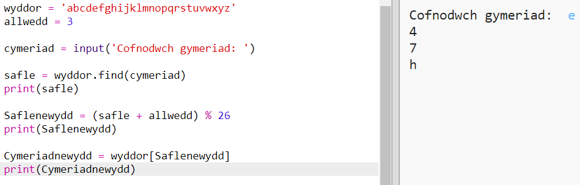

+ Rhowch gynnig ar eich cod. Gallwch hefyd gael gwared â rhai o'ch datganiadau argraffu, gan argraffu'r cymeriad newydd ar y diwedd yn unig.
    
    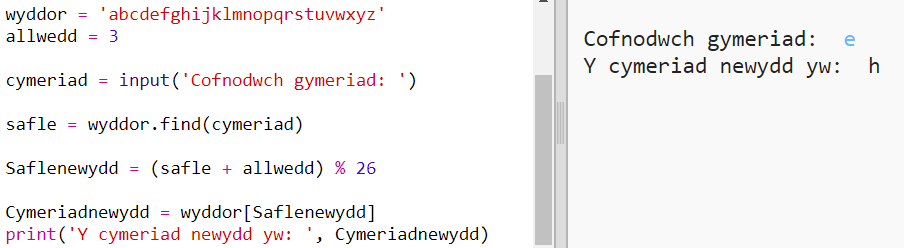