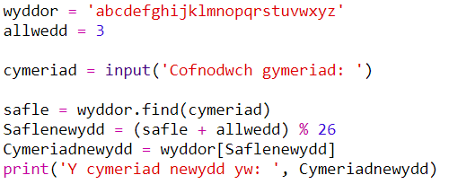
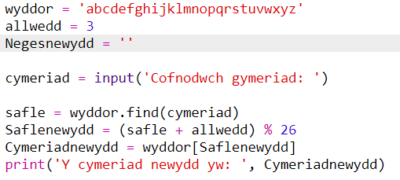
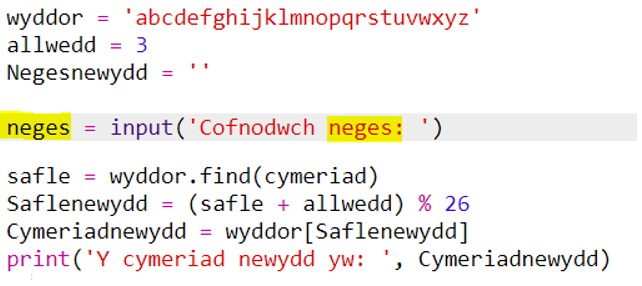
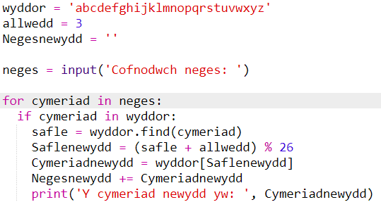
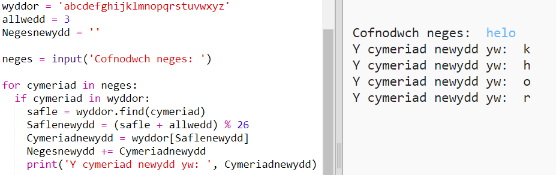
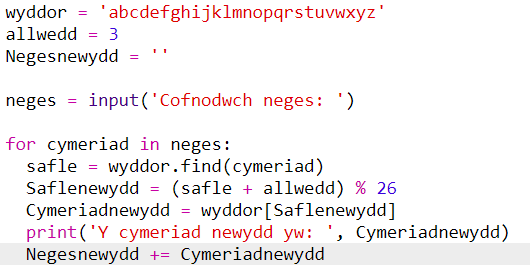
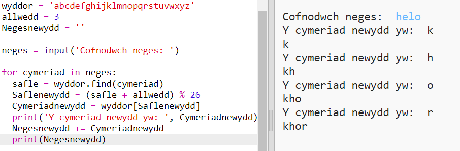
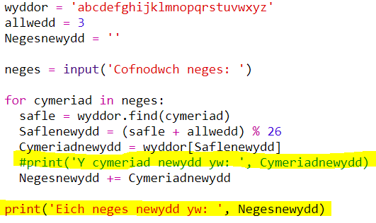

## Amgryptio negeseuon cyfan

Yn hytrach na dim ond amgryptio a dadgryptio negeseuon un cymeriad ar y tro, gadewch i ni newid y rhaglen i amgryptio negeseuon cyfan!

+ Yn gyntaf, gwiriwch fod eich cod yn edrych fel hyn:
    
    

+ Crëwch newidyn i storio'r neges amgryptiedig newydd.
    
    

+ Newidiwch eich cod i storio neges y defnyddiwr yn lle un cymeriad yn unig.
    
    

+ Ychwanegwch ddolen `for` (ar gyfer) i'ch cod, a mewnolwch weddill y cod fel ei fod yn cael ei ailadrodd ar gyfer pob cymeriad yn y neges.
    
    

+ Profwch eich cod. Dylech weld bod pob cymeriad yn y neges wedi'i amgryptio a'i argraffu un ar y tro.
    
    

+ Gadewch i ni ychwanegu pob cymeriad wedi'i amgryptio i newidyn eich `neges newydd`.
    
    

+ Gallwch `argraffu` y `neges newydd` wrth iddi gael ei hamgryptio.
    
    

+ Os ydych chi'n dileu'r bylchau cyn y datganiad `argraffu`, bydd y neges wedi'i hamgryptio ond yn ymddangos unwaith ar y diwedd. Gallwch hefyd ddileu'r cod ar gyfer argraffu safleoedd y cymeriadau.
    
    