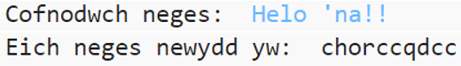
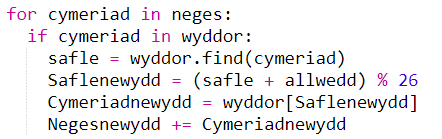
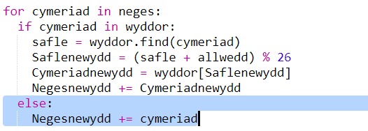
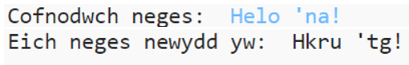

## Cymeriadau ychwanegol

Nid yw rhai cymeriadau yn yr wyddor, sy'n achosi gwall.

+ Profwch eich cod gyda rhai cymeriadau nad ydynt yn yr wyddor.
    
    Er enghraifft, gallech ddefnyddio'r neges `Helo 'na!!`.
    
    
    
    Sylwch fod y bwlch a'r cymeriadau `!` oll wedi'u hamgryptio fel y llythyren 'c'!

+ I drwsio hyn, does dim ond angen i chi gyfieithu cymeriad os yw yn yr wyddor. I wneud hyn, ychwanegwch ddatganiad `if` (os) at eich cod, a mewnoli gweddill eich cod.
    
    

+ Profwch eich cod gyda'r un neges. Beth sy'n digwydd y tro hwn?
    
    
    
    Nawr, mae eich cod yn sgipio unrhyw gymeriad os nad yw yn yr wyddor.

+ Byddai'n well pe na bai eich cod yn amgryptio unrhyw beth nad yw yn yr wyddor, gan ddefnyddio'r cymeriad gwreiddiol yn lle.
    
    Ychwanegwch ddatganiad `else` (arall) at eich cod, sy'n ychwanegu'r cymeriad gwreiddiol i'r neges wedi'i hamgryptio.
    
    

+ Profwch eich cod. Dylech weld bod unrhyw gymeriad yn yr wyddor wedi'i hamgryptio, ond fod unrhyw gymeriadau eraill yn cael llonydd!
    
    