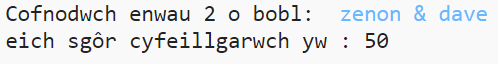
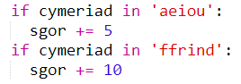
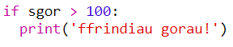

\--- challenge \---

## Her: Cyfrifiannell cyfeillgarwch

Ysgrifennwch raglen i ddangos pa mor gydnaws yw 2 o bobl, trwy gyfrifo sgôr cyfeillgarwch.

Gallai'r rhaglen ddolennu trwy bob un o'r cymeriadau yn y 2 enw, ac ychwanegu pwyntiau at newidyn `sgôr` bob tro y darganfyddir rhai llythrennau.

Dylech benderfynu ar reolau ar gyfer dyfarnu pwyntiau. Er enghraifft, gallech ddyfarnu pwyntiau ar gyfer llafariaid, neu gymeriadau a geir yn y gair "ffrind":

Gallech hefyd roi neges bersonol i'r defnyddiwr, yn seiliedig ar ei sgôr:

\--- /challenge \---