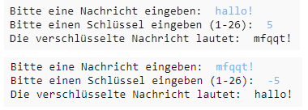

## Einleitung:

In diesem Projekt lernst du, wie du dein eigenes Verschlüsselungsprogramm schreiben kannst um mit einem Freund/einer Freundin geheime Nachrichten auszutauschen. Dieses Projekt knüpft an die Aktivität "Earth to Principia" (Erde an Principia) auf Seite 16 vom "Space Diary" (Weltraumtagebuch) an (siehe principiaspacediary. org).

<div class="trinket">
  <iframe src="https://trinket.io/embed/python/402256078c?outputOnly=true&start=result" width="600" height="500" frameborder="0" marginwidth="0" marginheight="0" allowfullscreen>
  </iframe>
  
</div>

### Zusätzliche Information für Clubleiter

Falls Sie dieses Projekt ausdrucken müssen, dann verwenden Sie bitte die [druckfreundliche Version](https://projects.raspberrypi.org/en/projects/secret-messages/print).

## \--- collapse \---

## title: Hinweise für Clubleiter

## Einleitung:

In diesem Projekt lernen die Kinder, wie man ein Verschlüsselungsprogramm schreibt, um geheime Nachrichten mit einem Freund/einer Freundin auszutauschen. Dieses Projekt führt eine Iteration (Schleifenbildung) über eine Textzeichenfolge ein.

## Online-Ressourcen

**Dieses Projekt verwendet Python 3.** Wir empfehlen die Verwendung von [Trinket](https://trinket.io/), um Python-Programme online zu schreiben. Dieses Projekt enthält die folgenden Trinkets:

* [Neues (leeres) Python Trinket - jumpto.cc/python-new](http://jumpto.cc/python-new)

Außerdem ist ein Trinket mit dem fertigen Projekt verfügbar:

* [Fertiges Projekt ‘Geheime Nachrichten’ -- trinket.io/python/402256078c](https://trinket.io/python/402256078c)

* [Fertiges Projekt ‘Freundschaftsrechner’ -- trinket.io/python/2e852cd687](https://trinket.io/python/2e852cd687)

## Offline-Ressourcen

Dieses Projekt kann wahlweise auch [offline](https://www.codeclubprojects.org/en-GB/resources/python-working-offline/) durchgeführt werden.

Eine vollständige Version dieses Projekts finden Sie auch im Abschnitt "Ressourcen für freiwillige Mitarbeiter" mit diesem Inhalt:

* messages-finished/messages.py
* messages-finished/friends.py

(Alle oben genannten Ressourcen werden auch zum Download als `.zip`-Dateien für das Projekt und für freiwillige Mitarbeiter bereitgestellt.)

## Lernziele

* Iteration (ausführung einer Schleife) an einer String-Variable;
* Die `find()` Methode;
* Der Modulo-Operator (`%`).

Dieses Projekt umfasst Elemente aus den folgenden Zweigen des [Raspberry Pi Digital Making Curriculum](http://rpf.io/curriculum):

* [Kombination von verschiedenen Programmierstrukturen um ein Problem zu lösen.](https://www.raspberrypi.org/curriculum/programming/builder)

## Herausforderungen

* Verwenden einer Caesar-Verschlüsselung - manuelles Verschlüsseln und Entschlüsseln von Buchstaben und Wörtern;
* Verschiedene Schlüssel - sie erlauben dem Benutzer, einen selbst gewählten Schlüssel einzugeben;
* Verschlüsseln und Entschlüsseln von Nachrichten - Verschlüsseln und Entschlüsseln ganzer Nachrichten;
* Freundschaftsrechner - Text-Iteration auf ein neues Problem anwenden.

## Häufig gestellte Fragen

* Bei der Suche mit `find()` oder `if char in alphabet:` Beachten Sie, dass bei der Suche die Groß- und Kleinschreibung berücksichtigt wird. Kinder können folgendes benutzen:
    
    ```python
    nachricht = input('Bitte eine Nachricht zum Verschlüsseln eingeben: ').lower()
    ```
    
    um die Eingabe vor der Suche in Kleinbuchstaben umzuwandeln.

\--- /collapse \---

## \--- collapse \---

## title: Projektmaterial

## Projektressourcen

* [.zip-Datei mit allen Projektressourcen](resources/secret-messages-project-resources.zip)
* [Leeres Python-Trinket online](http://jumpto.cc/python-new)
* [Leere Python-Datei offline](resources/new-new.py)

## Ressourcen für Clubleiter

* [.zip-Datei mit allen Ressourcen vom fertigen Projekt](resources/secret-messages-volunteer-resources.zip)
* [Fertiges online Trinket-Projekt](https://trinket.io/python/402256078c)
* [secret-messages-finished/messages.py](resources/secret-messages-finished-messages.py)
* [Online-Lösungsvorschlag für die Herausforderung 'Freundschaftsrechner'](https://trinket.io/python/2e852cd687)
* [Offline-Lösungsvorschlag für die Herausforderung 'Freundschaftsrechner'](resources/friendship-calculator-finished-friends.py)

\--- /collapse \---