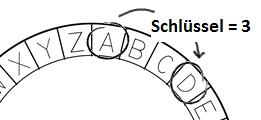

## Die Caesar-Schiffre

Eine Schiffre ist eine Art Geheimcode, bei dem man die Buchstaben miteinander vertauscht, damit niemand die Mitteilung lesen kann.

Du wirst eine der ältesten und berühmtesten Schiffre benutzen, die __Caesar-Schiffre __, welche nach dem römischen Herrscher Julius Caesar benannt ist.

Ehe wir mit der Programmierung beginnen, lass uns versuchen die Caesar-Schiffre zu benutzen, um ein Wort zu verstecken.

+ Das Verstecken eines Wortes wird __Verschlüsselung__ genannt.

	Lass uns damit beginnen, den Buchstaben 'a' zu verschlüsseln. Damit wir dies tun können, müssen wir das Alphabet in einem Kreis zeichnen, wie z. B. so:

	

+ Damit du einen geheimen, verschlüsselten Buchstaben von einem normalen Buchstaben anfertigen kannst, brauchst du einen geheimen Key (Schlüssel). Lass uns die Zahl 3 als Key benutzen (du kannst dir jedoch eine beliebige Zahl ausdenken).

	Damit du den Buchstaben 'a' __verschlüsselst__  musst du 3 Buchstaben im Uhrzeigersinn weiter gehen, wodurch du dann den Buchstaben 'd' erhältst:

	

+ Du kannst das, was du gelernt hast, dazu benutzen, ein komplettes Wort zu verschlüsseln. 'hello' (Hallo!) wird zum Beispiel als 'khoor' verschlüsselt. Probiere es selbst einmal aus.

	+ h + 3 = __k__
	+ e + 3 = __h__
	+ l + 3 = __o__
	+ l + 3 = __o__
	+ o + 3 = __r__

+ Wenn man den Text wieder zum ursprünglichen Zustand zurückstellt, nennt man das __Entschlüsselung__. Um ein Wort zu entschlüsseln, musst du einfach nur den Key subtrahieren (abziehen), anstatt ihn zu addieren:

	+ k - 3 = __h__
	+ h - 3 = __e__
	+ o - 3 = __l__
	+ o - 3 = __l__
	+ r - 3 = __o__	
