## Buchstaben verschlüsseln

Lass uns ein Python Programm schreiben, um ein einzelnes Zeichen zu verschlüsseln.

+ Öffne die leere Python Vorlage in trinket: <a href="http://jumpto.cc/python-new" target="_blank">jumpto.cc/python-new</a>.

+ Anstatt das Alphabet in einem Kreis aufzuzeichnen, lass es uns als String-Variable `alphabet` aufschreiben.
    
    

+ Jeder Buchstabe des Alphabets hat eine Positionsnummer, wir beginnen bei der Positionsnummer 0. Das heißt also, dass der Buchstabe ‘a’ sich bei Positionsnummer 0 des Alphabets befindet und der Buchstabe ‘c’ sich auf der Positionsnummer 2 befindet.
    
    

+ Du kannst einen Buchstaben aus deiner Variablen `alphabet` erhalten, indem du die Positionsnummer in eckigen Klammern schreibst.
    
    
    
    Du kannst die `print` Statements (drucken) löschen, nachdem du alles ausprobiert hast.

+ Als nächstes musst du den geheimen Schlüssel in der Variable `key` speichern.
    
    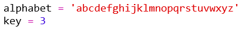

+ Frage dann den Nutzer nach einem Buchstaben, um diesen zu verschlüsseln.
    
    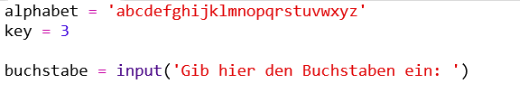

+ Finde die Positionsnummer (`position`) des Buchstabens (`buchstabe`) im Alphabet.
    
    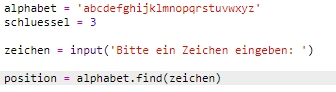

+ Du kannst die gespeicherte Positionsnummer `(position)` testen, indem du sie ausdruckst. Zum Beispiel, ob sich das Zeichen ‘e’ bei der Positionsnummer 4 im Alphabet befindet.
    
    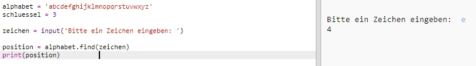

+ Um den Buchstaben (`buchstabe`) zu verschlüsseln, musst du den Schlüssel (`key`) mit der Positionsnummer (`position`) addieren. Das Ergebnis wird in der Variablen `neuePosition` gespeichert.
    
    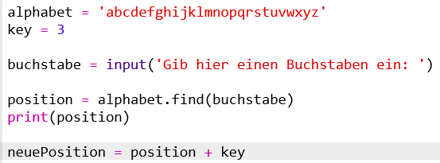

+ Füge nun den Programmcode hinzu, um diese neue Position des Buchstabens auszudrucken.
    
    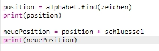

+ Teste deinen neuen Code aus. Da unser `key` = 3 ist, sollte er die Zahl 3 zu der Positionsnummer (`position`) addieren und in der Variablen `neuePosition` als neue Positionsnummer speichern.
    
    Zum Beispiel befindet sich der Buchstabe ‘e’ auf der Positionsnummer 4. Um dies zu verschlüsseln, addierst du den `key` (3), was insgesamt 7 ergibt.
    
    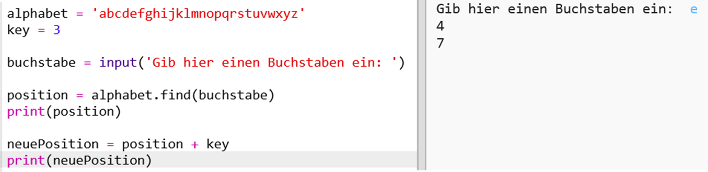

+ • Was passiert, wenn du versuchst, den Buchstaben ‘y’ zu verschlüsseln?
    
    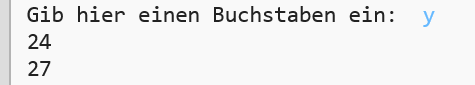
    
    Siehst du, dass die neue Positionsnummer (`neuePosition`) jetzt 27 beträgt? Aber es gibt gar nicht 27 Buchstaben im Alphabet!

+ Du kannst den Modulo-Operator `%` benutzen, um der neuen Positionsnummer mitzuteilen, wieder auf die Positionsnummer 0 zurückzugehen, nachdem sie die Positionsnummer 26 erreicht hat.
    
    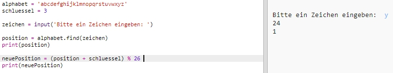

+ Und zum Schluss wollen wir den Buchstaben in der neuen Positionsnummer ausdrucken.
    
    Zum Beispiel, wenn du den Schlüssel (key) zur Positionsnummer des Buchstaben ‘e’ addierst, erhältst du 7 und der Buchstabe auf der Positionsnummer 7 des Alphabets ist das ‘h’.
    
    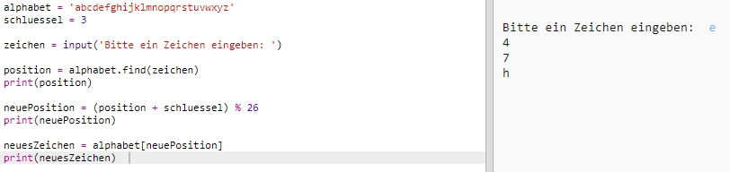

+ Probiere deinen neuen Code aus. Du kannst auch manche deiner print-Statements (Drucken) entfernen und einfach nur am Ende das neue Zeichen ausdrucken.
    
    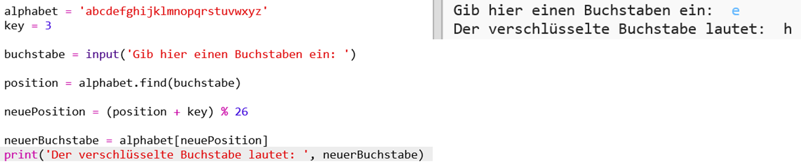