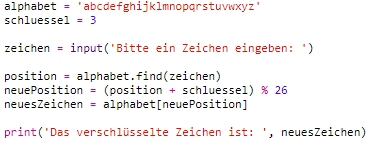
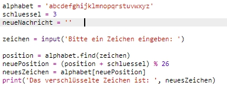
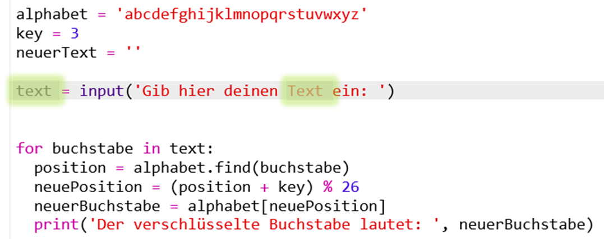
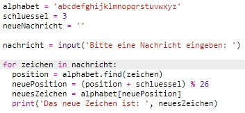
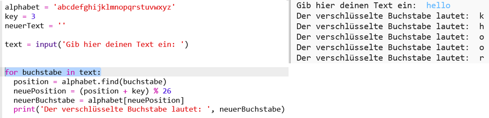
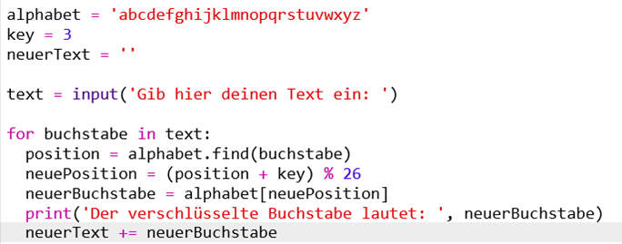
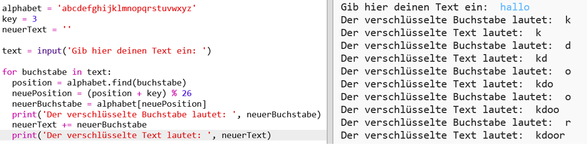
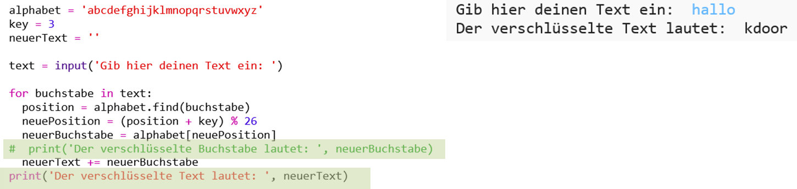

## Komplette Mitteilungen verschlüsseln

Anstatt die Nachricht mit nur je einem Zeichen einzeln zu verschlüsseln bzw. zu entschlüsseln, lass uns jetzt das Programm so ändern, dass komplette Mitteilungen verschlüsselt werden!

+ Prüfe als Erstes, ob dein Code so aussieht:
    
    

+ Erstelle eine anfänglich leere String-Variable, um die neue, verschlüsselte Mitteilung zu speichern.
    
    

+ Ändere deinen Code, damit du die Mitteilung des Nutzers und nicht nur ein Zeichen speichern kannst.
    
    

+ Füge eine `for` - Schleife zu deinem Code hinzu und rücke den Rest des Codes ein, damit er für jedes Zeichen in der Mitteilung wiederholt wird.
    
    

+ Teste deinen Code. Du solltest sehen können, dass jedes Zeichen in der Mitteilung verschlüsselt ist und je einzeln ausgedruckt wird.
    
    

+ Lass uns nun jedes der verschlüsselten Zeichen deiner Variablen `neuerText` hinzufügen.
    
    

+ You can `print` the `newMessage` as it is being encrypted.
    
    

+ Wenn du die Leerzeichen vor dem `print` - Statement (drucken) löschst, wird die verschlüsselte Mitteilung nur einmal am Ende angezeigt. Du kannst auch den Code zum Drucken der Positionsnummern der Buchstaben löschen.
    
    