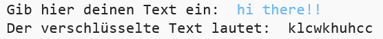
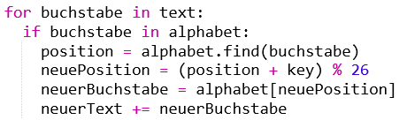
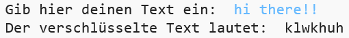
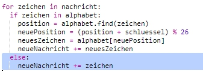

## Zusätzliche Zeichen

Manche Zeichen sind nicht im Alphabet, was zu einem Fehler führen kann.

+ Teste deinen Code mit ein paar Zeichen, die nicht im Alphabet sind.
    
    Du könntest zum Beispiel die Mitteilung `hi there!!` (Hallo zusammen!!) benutzen.
    
    
    
    Siehst du, dass das Leerzeichen und alle ! - Zeichen als Buchstabe ‘c’ verschlüsselt worden sind?

+ Um dieses Problem zu beheben, solltest du ein Zeichen nur übersetzen, wenn es im Alphabet ist. Um dies zu tun, füge deinem Code ein `if` - Statement (wenn - dann) zu und rücke den Rest deines Codes ein.
    
    

+ Teste deinen Code mit der gleichen Mitteilung. Was passiert diesmal?
    
    
    
    Jetzt überspringt dein Code jedes Zeichen, wenn es nicht im Alphabet ist.

+ Es wäre besser, wenn dein Code nicht alles, was nicht im Alphabet steht, überspringen würde, sondern statt dessen nur das ursprüngliche Zeichen benutzen würde.
    
    Füge ein `else` - Statement (andernfalls) deinem Code hinzu, was das ursprüngliche Zeichen zur verschlüsselten Mitteilung hinzufügt.
    
    

+ Teste deinen Code. Du wirst sehen, dass jedes Zeichen im Alphabet verschlüsselt ist, dass aber alle anderen Zeichen im Originalzustand bleiben!
    
    