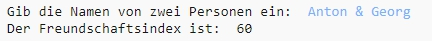
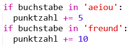
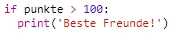

\--- challenge \---

## Herausforderung: Freundschaftsrechner

Schreibe ein Programm, um zu zeigen, wie gut 2 Menschen zueinander passen, indem du deren Freundschaftsindex berechnest.

Das Programm könnte jedes Zeichen in den beiden Namen durchlaufen; und jedes Mal, wenn ein bestimmter Buchstabe gefunden wird, werden Punkte zu der Variablen `punkte` addiert.

Du solltest die Regeln für die Zuteilung von Punkten festlegen. Zum Beispiel könntest du Punkte für Vokale verteilen oder für Zeichen, die im Wort “Freund” auftreten:

Am Ende könntest du dem Benutzer eine persönliche Nachricht anzeigen, die auf der Punktzahl basiert:

\--- /challenge \---