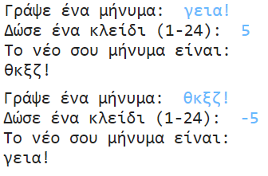

## Εισαγωγή:

Σε αυτό το έργο, θα μάθεις να φτιάχνεις το δικό σου πρόγραμμα κρυπτογράφησης, να στέλνεις και να λαμβάνεις μυστικά μηνύματα με έναν φίλο. Αυτό το έργο συνδέεται με τη δραστηριότητα "Γη προς Principia" στη σελίδα 16 του Διαστημικού Ημερολογίου.

<div class="trinket">
  <iframe src="https://trinket.io/embed/python/402256078c?outputOnly=true&start=result" width="600" height="500" frameborder="0" marginwidth="0" marginheight="0" allowfullscreen>
  </iframe>
  
</div>

### Πρόσθετες πληροφορίες για τους συντονιστές των ομάδων

Αν χρειαστεί να εκτυπώσεις αυτό το έργο, χρησιμοποίησε την [εκτυπώσιμη έκδοση](https://projects.raspberrypi.org/en/projects/secret-messages/print).

## \--- collapse \---

## title: Σημειώσεις συντονιστή ομάδας

## Εισαγωγή:

Σε αυτό το έργο, τα παιδιά θα μάθουν να φτιάξουν ένα πρόγραμμα κρυπτογράφησης, για να στέλνουν και να λαμβάνουν μυστικά μηνύματα με έναν φίλο. Αυτό το έργο εισάγει την έννοια της επανάληψης (looping) επί μίας σειράς χαρακτήρων.

## Online Πόροι

**Αυτό το έργο χρησιμοποιεί Python 3.** Συνιστούμε να χρησιμοποιήσετε [trinket](https://trinket.io/) για να γράψετε Python online. Το έργο αυτό περιλαμβάνει τα ακόλουθα Trinkets:

* [Νέο (κενό) Python Trinket -- jumpto.cc/python-new](http://jumpto.cc/python-new)

Υπάρχει επίσης ένα trinket που περιέχει το τελικό έργο:

* ["Μυστικά Μηνύματα" ολοκληρωμένο έργο -- trinket.io/python/402256078c](https://trinket.io/python/402256078c)

* ["Υπολογιστής φιλίας" ολοκληρωμένο έργο -- trinket.io/python/2e852cd687](https://trinket.io/python/2e852cd687)

## Offline Πόροι

Το έργο αυτό μπορεί να [ολοκληρωθεί χωρίς σύνδεση](https://www.codeclubprojects.org/en-GB/resources/python-working-offline/) αν προτιμάς.

Μπορείς να βρεις το ολοκληρωμένο έργο στο τμήμα «Πόροι εθελοντών», το οποίο περιέχει:

* messages-finished/messages.py
* messages-finished/friends.py

(Όλοι οι παραπάνω πόροι μπορούν επίσης να κατέβουν ως συμπιεσμένα `.zip` αρχεία.)

## Στόχοι μάθησης

* Επανάληψη (looping) επί μίας σειράς χαρακτήρων.
* Η μέθοδος `find()`
* Ο τελεστής υπόλοιπου διαίρεσης (`%`).

Αυτό το έργο καλύπτει στοιχεία από τις ακόλουθες πτυχές του [Προγράμματος Μαθημάτων Ψηφιακής Δημιουργίας του Raspberry Pi](http://rpf.io/curriculum):

* [Συνδύασε δομές προγραμματισμού για να λύσεις ένα πρόβλημα.](https://www.raspberrypi.org/curriculum/programming/builder)

## Προκλήσεις

* Use a Caesar cipher - encrypt and decrypt letters and words manually;
* Μεταβλητά κλειδιά - επιτρέπουν στο χρήστη να εισάγει ένα επιλεγμένο κλειδί.
* Κρυπτογράφηση και αποκρυπτογράφηση μηνυμάτων - κρυπτογράφηση και αποκρυπτογράφηση ολόκληρων μηνυμάτων.
* Υπολογιστής φιλίας - εφαρμογή της επανάληψης επί σειράς χαρακτήρων σε νέο πρόβλημα.

## Συχνές Ερωτήσεις

* Όταν πραγματοποιείς αναζήτηση χρησιμοποιώντας`find()` ή `if char in alphabet:`, σημείωσε ότι στις αναζητήσεις γίνεται διάκριση πεζών-κεφαλαίων. Τα παιδιά μπορούν να χρησιμοποιήσουν:
    
    ```python
    message = input("Παρακαλώ γράψε ένα μήνυμα για κρυπτογράφηση: ").lower()
    ```
    
    για να μετατρέψεις το κείμενο σε μικρά γράμματα πριν από την αναζήτηση.

\--- /collapse \---

## \--- collapse \---

## title: Υλικό έργου

## Πόροι έργου

* [αρχείο .zip που περιέχει όλους τους πόρους του έργου](resources/secret-messages-project-resources.zip)
* [Online κενό Python Trinket](http://jumpto.cc/python-new)
* [Offline κενό αρχείο Python](resources/new-new.py)

## Πόροι συντονιστή ομάδας

* [αρχείο .zip που περιέχει όλους τους πόρους του έργου](resources/secret-messages-volunteer-resources.zip)
* [Online ολοκληρωμένο έργο στο Τrinket](https://trinket.io/python/402256078c)
* [secret-messages-finished/messages.py](resources/secret-messages-finished-messages.py)
* [Online ολοκληρωμένη πρόκληση 'Υπολογιστή Φιλίας'](https://trinket.io/python/2e852cd687)
* [offline ολοκληρωμένη πρόκληση 'Υπολογιστή Φιλίας'](resources/friendship-calculator-finished-friends.py)

\--- /collapse \---