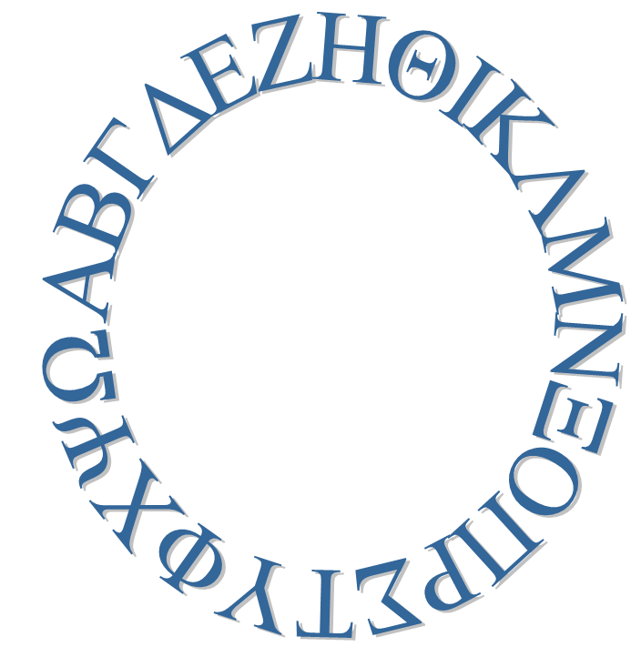
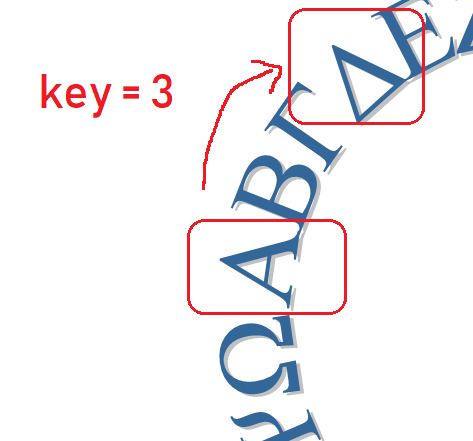

## Ο κώδικας του Καίσαρα

Ένας κρυπτογραφημένος κώδικας είναι ένας τύπος μυστικού κώδικα, όπου αντικαθιστάς τα γράμματα, έτσι ώστε κανείς να μην μπορεί να διαβάσει το μήνυμά σου.

Θα χρησιμοποιήσεις ένα από τα παλαιότερα και πιο διάσημα συστήματα κρυπτογράφησης, τον **Κώδικα του Καίσαρα**, που ονομάστηκε έτσι από τον Ιούλιο Καίσαρα.

Πριν ξεκινήσουμε την κωδικοποίηση, ας προσπαθήσουμε να χρησιμοποιήσουμε τον κώδικα του Καίσαρα για να αποκρύψουμε μια λέξη.

+ Η απόκρυψη μιας λέξης λέγεται **κρυπτογράφηση**.
    
    Ας αρχίσουμε με την κρυπτογράφηση του γράμματος «α». Για να γίνει αυτό, μπορούμε να παρατάξουμε το αλφάβητο σε έναν κύκλο, όπως εδώ:
    
    

+ Για να μετατρέψεις ένα κανονικό γράμμα σε κρυπτογραφημένο, πρέπει να έχεις ένα μυστικό κλειδί. Ας χρησιμοποιήσουμε τον αριθμό 3 ως κλειδί (αλλά μπορείς να χρησιμοποιήσεις οποιοδήποτε αριθμό σου αρέσει).
    
    Για να **κρυπτογραφήσεις** το γράμμα «α», απλά μετακινήσου κατά 3 γράμματα στη φορά των δεικτών του ρολογιού, το οποίο θα σου δώσει το γράμμα «δ»:
    
    

+ Μπορείς να χρησιμοποιήσεις όσα έχεις μάθει για να κρυπτογραφήσεις μια ολόκληρη λέξη. Για παράδειγμα, η κρυπτογραφημένη λέξη για τη 'γεια' είναι 'ζθμδ'. Δοκίμασε μόνος σου.
    
    + γ + 3 = **ζ**
    + ε + 3 = **θ**
    + ι + 3 = **μ**
    + α + 3 = **δ**
    + 

+ Η επαναφορά του κειμένου στο κανονικό λέγεται **αποκρυπτογράφηση**. Για να αποκρυπτογραφήσεις μια λέξη, απλώς αφαιρείς το κλειδί αντί να το προσθέσεις:
    
    + ζ - 3 = **γ**
    + θ - 3 = **ε**
    + μ - 3 = **ι**
    + δ - 3 = **α**
    +