## Κρυπτογράφηση επιστολών

Ας γράψουμε ένα πρόγραμμα Python για την κρυπτογράφηση ενός μόνο χαρακτήρα.

+ Ανοίξτε το κενό πρότυπο Python Trinket: <a href="http://jumpto.cc/python-new" target="_blank">jumpto.cc/python-new</a>.

+ Αντί να παρατάξουμε το αλφάβητο σε έναν κύκλο, ας το γράψουμε ως μεταβλητή `alphabet`.
    
    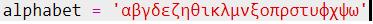

+ Κάθε γράμμα του αλφαβήτου έχει μία θέση, αρχίζοντας από τη θέση 0. Έτσι το γράμμα «α» βρίσκεται στη θέση 0 του αλφαβήτου και το «γ» βρίσκεται στη θέση 2.
    
    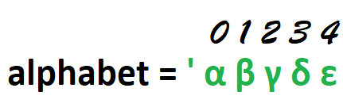

+ Μπορείς να πάρεις ένα γράμμα από τη μεταβλητή `alphabet` γράφοντας τη θέση σε αγκύλες.
    
    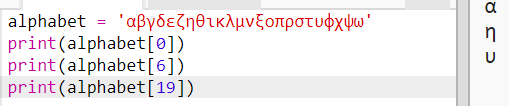
    
    Μπορείς να διαγράψεις τις εντολές `print` αφού το δοκιμάσεις.

+ Στη συνέχεια, θα πρέπει να αποθηκεύσεις το μυστικό κλειδί `key` σε μια μεταβλητή.
    
    

+ Έπειτα, ζήτησε από τον χρήστη ένα μόνο γράμμα (που ονομάζεται `character`) για να κρυπτογραφηθεί.
    
    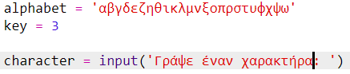

+ Βρες τη θέση `position` του γράμματος `character`.
    
    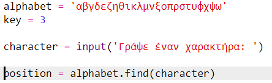

+ Μπορείς να ελέγξεις την αποθηκευμένη θέση `position` με την εντολή print. Για παράδειγμα, να ελέγξεις ότι ο χαρακτήρας «ε» βρίσκεται στη θέση 4 στο αλφάβητο.
    
    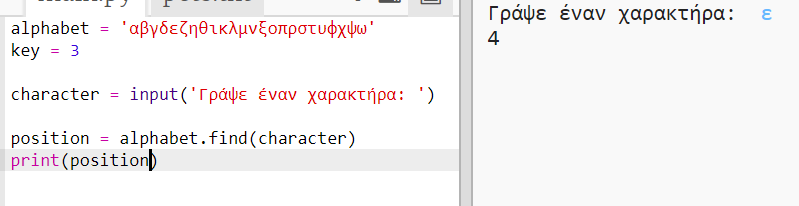

+ Για να κρυπτογραφήσεις το γράμμα `character`, θα πρέπει να προσθέσεις το `key` στη θέση `position`. Το αποτέλεσμα στη συνέχεια αποθηκεύεται σε μια μεταβλητή `newPosition`.
    
    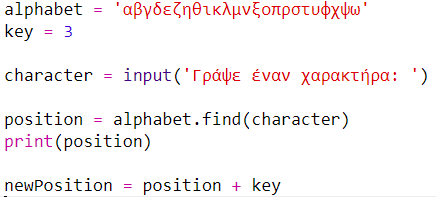

+ Πρόσθεσε τον παρακάτω κώδικα για να εμφανίσεις τη νέα θέση του χαρακτήρα.
    
    

+ Δοκίμασε τον νέο σου κώδικα. Επειδή το κλειδί `key` είναι 3, θα πρέπει να προσθέσεις 3 στη θέση `position` και να το αποθηκεύσεις στη νέα σου μεταβλητή `newPosition`.
    
    Για παράδειγμα, το γράμμα «ε» είναι στη θέση 4. Για να κρυπτογραφήσεις, προσθέτεις στη θέση το `key` (3), και το αποτέλεσμα είναι 7.
    
    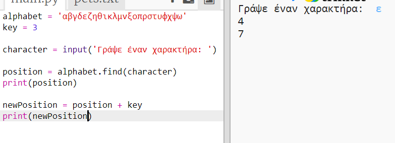

+ Τι συμβαίνει όταν προσπαθείς να κρυπτογραφήσεις το γράμμα 'ψ';
    
    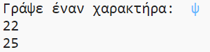
    
    Παρατήρησε πως η `newPosition` είναι 25 και δεν υπάρχουν 25 γράμματα στο αλφάβητο!

+ Μπορείς να χρησιμοποιήσεις έναν τελεστή `%` για να πεις στη νέα θέση να επιστρέψει στη θέση 0 μόλις βρεθεί στη θέση 24.
    
    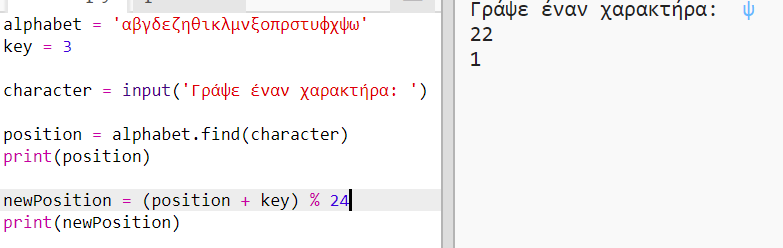

+ Τέλος, θα εκτυπώσεις το γράμμα στη νέα θέση.
    
    Για παράδειγμα, προσθέτοντας το κλειδί στο γράμμα 'ε' δίνει 7 και το γράμμα στη θέση 7 του αλφαβήτου είναι 'θ'.
    
    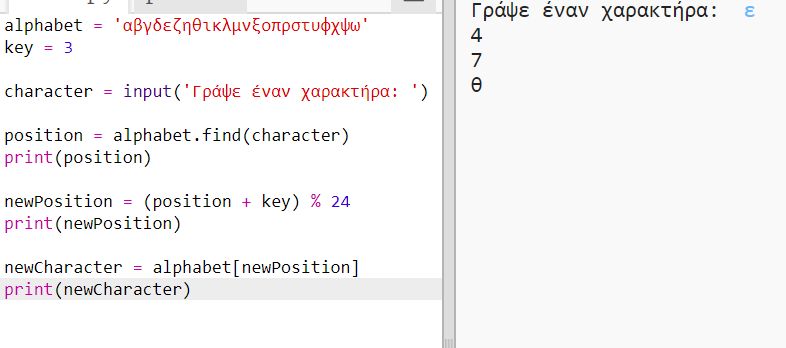

+ Δοκίμασε τον κώδικα σου. Μπορείς επίσης να σβήσεις ορισμένες από τις εντολές print, και να αφήσεις μονο στο τέλος να εμφανίζεται ο νέος χαρακτήρας.
    
    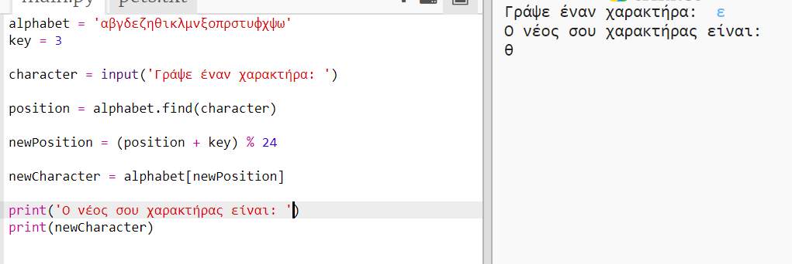