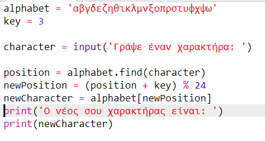
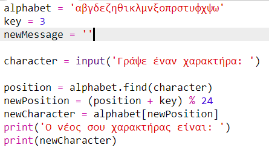
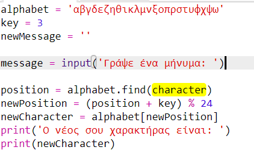
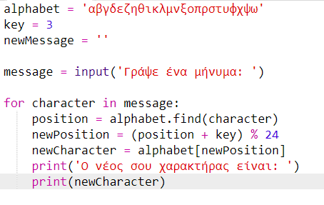
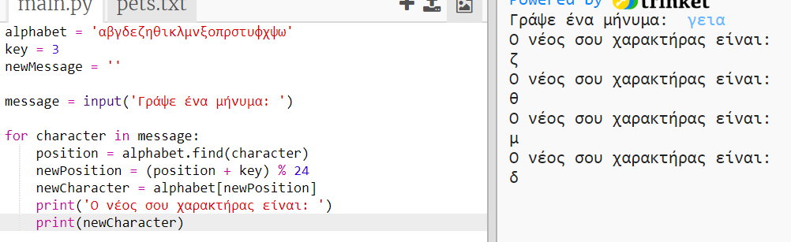
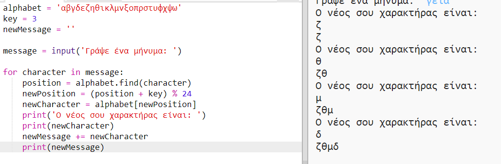
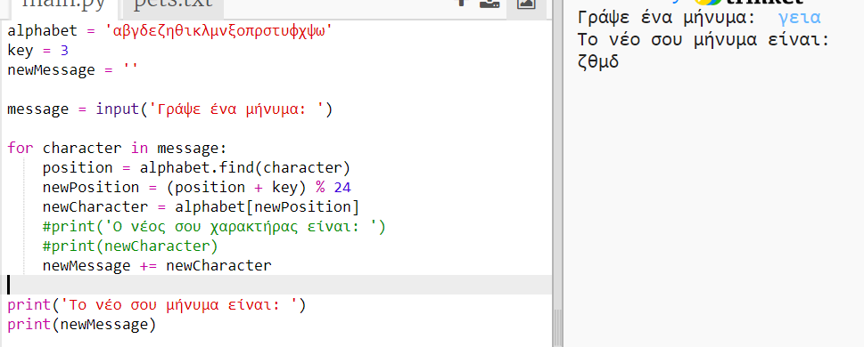

## Κρυπτογράφηση ολόκληρων μηνυμάτων

Αντί να κρυπτογραφείς και να αποκρυπτογραφείς τα μηνύματα ένα-ένα χαρακτήρα κάθε φορά, ας αλλάξουμε το πρόγραμμα για να κρυπτογραφήσουμε ολόκληρα μηνύματα!

+ Πρώτον, έλεγξε ότι ο κώδικας σου μοιάζει με αυτόν:
    
    

+ Δημιούργησε μια μεταβλητή για να αποθηκεύσεις το νέο κρυπτογραφημένο μήνυμα.
    
    

+ Άλλαξε τον κώδικά σου για να αποθηκεύσεις το μήνυμα του χρήστη και όχι μόνο ένα χαρακτήρα.
    
    

+ Πρόσθεσε ένα βρόχο `for` στον κώδικά σου και τοποθέτησε σε εσοχή το υπόλοιπο του κώδικα έτσι ώστε να επαναλαμβάνεται για κάθε χαρακτήρα του μηνύματος.
    
    

+ Δοκίμασε τον κώδικά σου. Θα δεις ότι κάθε φορά κρυπτογραφείται και εμφανίζεται από ένας χαρακτήρας.
    
    

+ Ας προσθέσουμε κάθε κρυπτογραφημένο χαρακτήρα στη μεταβλητή `newMessage`.
    
    

+ Μπορείς να `εμφανίζεις` το `newMessage` σταδιακά όσο κρυπτογραφείται.
    
    

+ Εάν διαγράψεις τα κενά πριν από την εντολή `print`, το κρυπτογραφημένο μήνυμα θα εμφανιστεί μόνο μία φορά στο τέλος. Μπορείς επίσης να διαγράψεις τον κώδικα για την εμφάνιση των θέσεων χαρακτήρων.
    
    