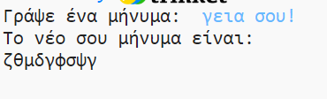
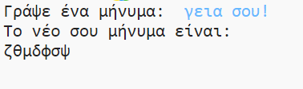
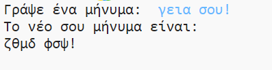

## Επιπλέον χαρακτήρες

Μερικοί χαρακτήρες δεν είναι στο αλφάβητο, γεγονός που προκαλεί σφάλμα.

+ Δοκίμασε τον κώδικά σου με ορισμένους χαρακτήρες που δεν υπάρχουν στο αλφάβητο.
    
    Για παράδειγμα, μπορείς να χρησιμοποιήσεις το μήνυμα `γεια σου!`.
    
    
    
    Παρατήρησε ότι οι χαρακτήρες του κενού και του `!` είναι κρυπτογραφημένοι ως το γράμμα "γ'!

+ Για να διορθώσεις αυτό το θέμα, θα μεταφράσεις ένα χαρακτήρα μόνο αν είναι στο αλφάβητο. Για να το κάνεις αυτό, προσθέτεις μία δήλωση `if` στον κώδικά σου, και εσοχή στο υπόλοιπο του κώδικά σου.
    
    

+ Δοκίμασε τον κώδικά σου με το ίδιο μήνυμα. Τι συμβαίνει αυτή τη φορά;
    
    
    
    Τώρα, ο κώδικάς σου απλά παραλείπει οποιονδήποτε χαρακτήρα δεν είναι στο αλφάβητο.

+ Θα ήταν καλύτερο αν ο κώδικάς σου δεν κρυπτογραφούσε οτιδήποτε δεν είναι στο αλφάβητο, αλλά απλώς χρησιμοποιούσε τον αρχικό χαρακτήρα.
    
    Πρόσθεσε μια δήλωση `else` στον κώδικα σου, η οποία προσθέτει μόνο τον αρχικό χαρακτήρα στο κρυπτογραφημένο μήνυμα.
    
    

+ Δοκίμασε τον κώδικα σου. Θα δεις ότι οποιοσδήποτε χαρακτήρας στο αλφάβητο κρυπτογραφείται, αλλά όλοι οι άλλοι χαρακτήρες παραμένουν ίδιοι!
    
    