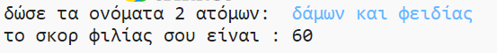
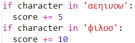
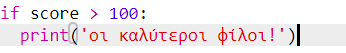

--- challenge ---

## Πρόκληση: Υπολογιστής φιλίας

Γράψε ένα πρόγραμμα για να δεις πόσο συμβατά είναι 2 άτομα, υπολογίζοντας ένα σκορ φιλίας.

Το πρόγραμμα θα μπορούσε να περνάει έναν έναν τους χαρακτήρες των 2 ονομάτων και να προσθέτει πόντους σε μια μεταβλητή `score` κάθε φορά που βρίσκονται συγκεκριμένα γράμματα. 

Θα πρέπει να αποφασίσεις τους κανόνες απονομής των πόντων. Για παράδειγμα, μπορείς να δίνεις πόντους για φωνήεντα ή χαρακτήρες που βρίσκονται στη λέξη "φίλος":

Θα μπορούσες επίσης να δώσεις στο χρήστη ένα εξατομικευμένο μήνυμα, με βάση το σκορ:

--- /challenge ---

### Κοινοτική συνεισφορά μετάφρασης 

Το έργο αυτό μεταφράστηκε από Μάνος Ζεάκης και αναθεωρήθηκε από Γιώργος Νικολαΐδης. 

Οι εκπληκτικοί μας εθελοντές-μεταφραστές μας βοηθούν να δώσουμε στα παιδιά όλου του κόσμου την ευκαιρία να μάθουν να προγραμματίζουν. Μπορείτε να μας βοηθήσετε να προσεγγίσουμε περισσότερα παιδιά μεταφράζοντας τα έργα μας - διαβάστε περισσότερα στο [rpf.io/translators](https://rpf.io/translators).
