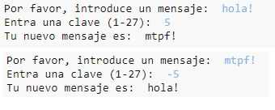

## Introducción:

En este proyecto aprenderás a escribir tu propio programa de encriptado para intercambiar mensajes secretos con un/a amigo/a. Este proyecto enlaza con la actividad "Earth to Principia" en la página 16 del Diario del Espacio (Space Diary).

<div class="trinket">
  <iframe src="https://trinket.io/embed/python/402256078c?outputOnly=true&start=result" width="600" height="500" frameborder="0" marginwidth="0" marginheight="0" allowfullscreen>
  </iframe>
  
</div>

### Información adicional para líderes de club

Si necesita imprimir este proyecto, use la [versión para imprimir](https://projects.raspberrypi.org/en/projects/secret-messages/print).

## \--- collapse \---

## title: Notas para el líder del club

## Introducción:

En este proyecto, los niños aprenderán cómo hacer un programa de encriptación para intercambiar mensajes secretos con un/a amigo/a. Este proyecto introduce la iteración (bucle) sobre una cadena de texto.

## Recursos en línea

**Este proyecto usa Python 3.** Recomendamos el uso de [Trinket](https://trinket.io/) para escribir Python en línea. Este proyecto contiene los siguientes Trinkets:

* [Trinket nuevo (en blanco) -- jumpto.cc/python-new](http://jumpto.cc/python-new)

También hay un Trinket con el proyecto acabado:

* [‘Mensajes secretos’ terminado -- trinket.io/python/402256078c](https://trinket.io/python/402256078c)

* [‘Calculadora de amistad’ terminado -- trinket.io/python/2e852cd687](https://trinket.io/python/2e852cd687)

## Recursos sin conexión

Este proyecto se puede [completar sin conexión](https://www.codeclubprojects.org/en-GB/resources/python-working-offline/) si se prefiere.

También se puede encontrar una versión completa de este proyecto en la sección 'Recursos para voluntarios', que contiene:

* messages-finished/messages.py
* messages-finished/friends.py

(Todos los recursos anteriores también se pueden descargar como archivos `.zip` de proyecto y voluntarios.)

## Objetivos de aprendizaje

* Iteración (bucle) sobre una variable de cadena;
* El método `find()`;
* El operador módulo (`%`).

Este proyecto incluye elementos de los siguientes aspectos del [Raspberry Pi Digital Making Curriculum](http://rpf.io/curriculum):

* [Combinar estructuras de programación para resolver un problema.](https://www.raspberrypi.org/curriculum/programming/builder)

## Desafíos

* Use a Caesar cipher - encrypt and decrypt letters and words manually;
* Claves variables - permitir al usuario la introducción de la clave elegida;
* Encriptar y desencriptar mensajes - encriptar y desencriptar mensajes enteros;
* Calculadora de amistad - aplicar la iteración sobre un texto a un nuevo problema.

## Preguntas frecuentes

* Cuando se realiza una búsqueda usando `find()` o `if char in alphabet:`, hay que tener en cuenta que las búsquedas distinguen entre mayúsculas y minúsculas. Los niños pueden usar:
    
    ```python
    mensaje = input("Por favor, introducir un mensaje para su encriptación: ").lower()
    ```
    
    para convertir lo introducido a minúsculas antes de realizar la búsqueda.

\--- /collapse \---

## \--- collapse \---

## title: Materiales del proyecto

## Recursos del proyecto

* [Archivo .zip que contiene todos los recursos del proyecto](resources/secret-messages-project-resources.zip)
* [Trinket Python en blanco en línea](http://jumpto.cc/python-new)
* [Trinket Python en blanco sin conexión](resources/new-new.py)

## Recursos para el líder del club

* [Archivo .zip que contiene todos los recursos de proyecto terminado](resources/secret-messages-volunteer-resources.zip)
* [Proyecto Trinket terminado en línea](https://trinket.io/python/402256078c)
* [secret-messages-finished/messages.py](resources/secret-messages-finished-messages.py)
* [Desafío 'Calculadora de la amistad' terminado en línea](https://trinket.io/python/2e852cd687)
* [Desafío 'Calculadora de la amistad' terminado sin conexión](resources/friendship-calculator-finished-friends.py)

\--- /collapse \---