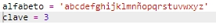
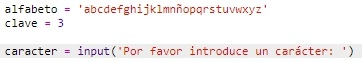
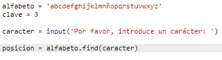
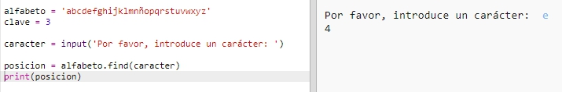
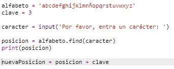
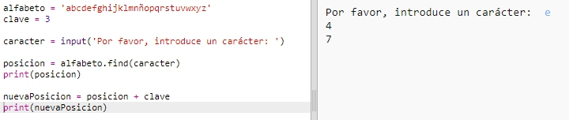
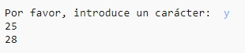
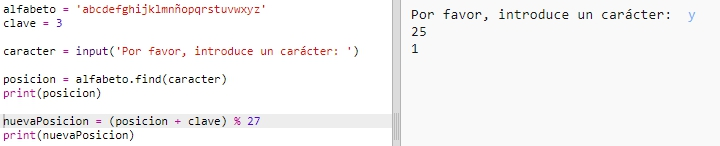
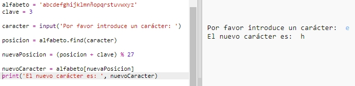

## Encriptación de letras

Escribamos un programa Python para encriptar un solo carácter. 

+ Abre el Trinket de la plantilla en blanco de Python: <a href="http://jumpto.cc/python-new" target="_blank">jumpto.cc/python-new</a>. 

+ En lugar de dibujar el abecedario en un círculo, escribámoslo como una variable `alphabet`.

	

+ Cada letra del abecedario posee una posición, comenzando desde la posición 0. Por lo tanto, la letra 'a' está en la posición 0 del abecedario y la letra  'c' en la posición 2.

	

+ Podrás obtener una letra de la variable `alphabet` escribiendo la posición en los corchetes.

	

	Podrás borrar las sentencias `print` una vez que lo hayas probado.

+ A continuación, necesitarás almacenar una `key` secreta en una variable.

		

+ A continuación, pide al usuario una letra (denominada `character`) a cifrar.

	

+ Encuentra la `position` del `character`.

	

+ Puedes probar la `position` almacenada imprimiéndola. Por ejemplo, el carácter 'e' está en la posición 4 del abecedario.

	

+ Para encriptar el `character`, debes añadir la `key` a la `position`.

	

+ Prueba el nuevo código. Puesto que tu `key` es 3, debe añadir 3 a la `position` y guardarla en la nueva variable `newPosition`. 

	Por ejemplo, la letra 'e' está en la posición 4. Para encriptarla, añade la `key` (3), obteniendo 7.

	

+ ¿Qué ocurre cuando intentas encriptar la letra 'y'?

	

	Observa cómo la `newPosition` es 27, sin embargo, !no hay 27 letras en el abecedario!

+ Podrás usar `%` para indicar a la nueva posición que regrese a la posición 0 una vez llegue a la posición 26. 

	

+ Por último, debes imprimir la letra en la nueva posición.

	Por ejemplo, añadir la clave a la letra 'e' da 7 y la letra de la posición 7 del abecedario es 'h'.

	

+ Prueba el código. También puedes eliminar algunas de las sentencias de impresión simplemente imprimiendo el nuevo carácter al final.

	
