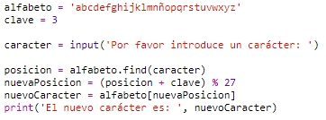
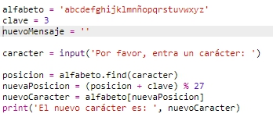
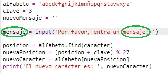
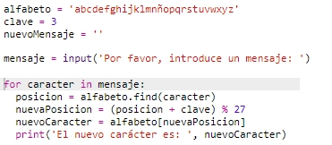
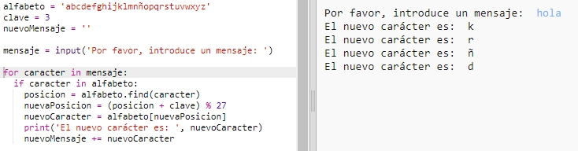
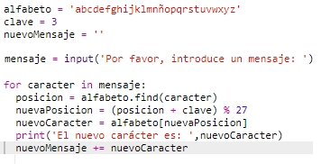
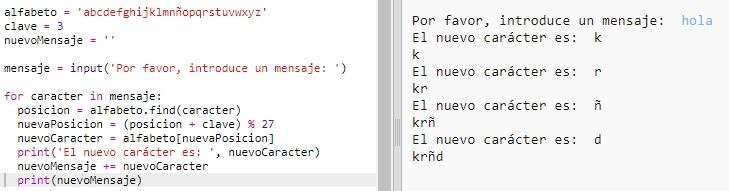
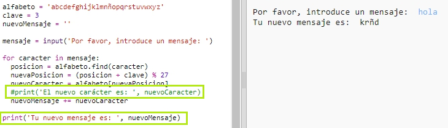

## Encriptar mensajes completos

En lugar de cifrar y descifrar solamente mensajes de un carácter, ¡cambiemos el programa para cifrar mensajes completos!

+ En primer lugar, comprueba que tu código se parece al siguiente:

	

+ Crea una variable para almacenar el nuevo mensaje cifrado.

	

+ Cambia tu código para almacenar el mensaje del usuario y no solamente un carácter.

	

+ Añade un bucle `for` a tu código y sangra el resto del código de modo que se repita para cada carácter del mensaje.

	

+ Prueba tu código. Deberías ver que cada carácter del mensaje es cifrado e impreso de uno en uno.

	

+ Añadamos cada carácter cifrado a la variable `newMessage`.

	

+ Podrás `print` `newMessage` según se va cifrando.

	

+ Si borras los espacios antes de la sentencia `print`, el mensaje cifrado solamente se visualizará una vez al final. También puedes borrar el código de impresión de las posiciones de los caracteres.

	

