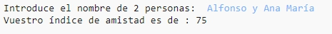
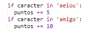
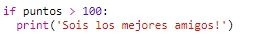

--- challenge ---

## Desafío: Calculadora de amistad

Escribe un programa para mostrar cuán compatibles son 2 personas calculando su índice de amistad.

El programa podría recorrer cada una de las letras de los 2 nombres y añadir puntos a una variable `puntos` cada vez que encuentra unas letras determinadas.

Debes decidir las reglas para otorgar puntos. Por ejemplo, podrías otorgar puntos por vocales o caracteres que se encuentran en la palabra "amigo":

También puedes mostrar al usuario un mensaje personalizado, basado en su puntuación:

--- /challenge ---

**Traducción aportada por la comunidad**

Este proyecto fue traducido por **Helmut Schlimper** y revisado por **Orlando Mendez**.

Nuestros increíbles voluntarios de traducción nos ayudan a dar a los niños de todo el mundo la oportunidad de aprender a programar. Puedes ayudarnos a llegar a más niños traduciendo nuestros proyectos. Consigue más información en [rpf.io/translate](https://rpf.io/translate).