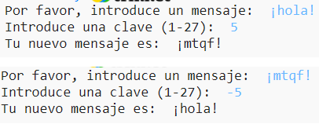

## Introducción:

En este proyecto, aprenderás cómo hacer tu propio programa de cifrado, para enviar y recibir mensajes secretos con un amigo. Este proyecto se enlaza con la actividad "Earth to Principia" en la página 16 del "Space Diary".

<div class="trinket">
  <iframe src="https://trinket.io/embed/python/402256078c?outputOnly=true&start=result" width="600" height="500" frameborder="0" marginwidth="0" marginheight="0" allowfullscreen>
  </iframe>
  
</div>

### Información adicional para los líderes del club

Si necesitas imprimir este proyecto, usa la [versión para imprimir](https://projects.raspberrypi.org/en/projects/secret-messages/print).

## \--- collapse \---

## title: Notas para el líder del club

## Introducción:

En este proyecto, los niños aprenderán a hacer un programa de cifrado, a enviar y recibir mensajes secretos con un amigo. Este proyecto introduce iteración (bucle) sobre una cadena de texto.

## Recursos en línea

**Este proyecto usa Python 3.** Recomendamos el uso de [Trinket](https://trinket.io/) para escribir Python en línea. Este proyecto contiene los siguientes Trinkets:

* [Nuevo Trinket de Python (en blanco) -- jumpto.cc/python-new](http://jumpto.cc/python-new)

También hay un Trinket con el proyecto acabado:

* [‘Mensajes secretos’ terminado -- trinket.io/python/402256078c](https://trinket.io/python/402256078c)

* [‘Calculadora de amistad’ terminado -- trinket.io/python/2e852cd687](https://trinket.io/python/2e852cd687)

## Recursos sin conexión

Este proyecto también se puede [completar sin conexión](https://www.codeclubprojects.org/en-GB/resources/python-working-offline/).

También se puede encontrar una versión completa de este proyecto en la sección 'Recursos para voluntarios', que contiene:

* messages-finished/messages.py
* messages-finished/friends.py

(Todos los recursos anteriores también se pueden descargar como archivos `.zip` de proyectos y para voluntarios.)

## Objetivos del Aprendizaje

* Iteración (bucle) sobre una variable de cadena;
* El método `find()`;
* El operador del módulo (`%`).

Este proyecto incluye elementos de los siguientes aspectos del currículo de creación digital [Raspberry Pi](http://rpf.io/curriculum):

* [Combinar estructuras de programación para resolver un problema.](https://www.raspberrypi.org/curriculum/programming/builder)

## Desafíos

* Usar un cifrado César - cifrar y descifrar letras y palabras manualmente;
* Claves variables - permitiendo al usuario introducir una clave elegida;
* Cifrar y descifrar mensajes - cifrar y descifrar mensajes enteros;
* Calculadora de amistad - aplicar iteración de texto a un nuevo problema.

## Preguntas frecuentes

* Cuando se realiza una búsqueda usando `find()` o `if char in alphabet:`, hay que tener en cuenta que las búsquedas distinguen entre mayúsculas y minúsculas. Los niños pueden usar:
    
    ```python
    mensaje= input("Por favor, introduzca un mensaje para cifrar: ").lower()
    ```
    
    para hacer la entrada minúscula antes de buscar.

\--- /collapse \---

## \--- collapse \---

## título: Materiales del proyecto

## Recursos del proyecto

* [archivo .zip que contiene todos los recursos del proyecto](resources/secret-messages-project-resources.zip)
* [Trinket Python en blanco en línea](http://jumpto.cc/python-new)
* [Trinket Python en blanco sin conexión](resources/new-new.py)

## Recursos del líder del club

* [archivo .zip que contiene todos los recursos del proyecto](resources/secret-messages-volunteer-resources.zip)
* [Proyecto Trinket completo en línea](https://trinket.io/python/402256078c)
* [mensajes-secretos-finalizados/mensajes.py](resources/secret-messages-finished-messages.py)
* [Desafío en línea completado 'Calculadora de amistad'](https://trinket.io/python/2e852cd687)
* [desafío de 'Calculadora de Amigos' sin conexión](resources/friendship-calculator-finished-friends.py)

\--- /collapse \---