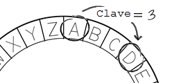

## El cifrado César

Un cifrado es un tipo de código secreto, donde se intercambian las letras para que nadie pueda leer tu mensaje.

Utilizarás uno de los cifrados más antiguos y famósos, el **cifrado César**, llamado así por Julio César.

Antes de empezar a escribir código, intentemos usar el cifrado César para ocultar una palabra.

+ Ocultar una palabra se llama **encriptación**.
    
    Empecemos encriptando la letra 'a'. Para hacerlo, podemos dibujar el alfabeto en un círculo, así:
    
    

+ Para hacer una letra encriptada a paritr de una normal, debes tener una clave secreta. Usemos el número 3 como la clave (pero puedes usar cualquier número que desees).
    
    Para **encriptar** la letra 'a', solo tienes que moverte 3 letras en el sentido de las agujas del reloj, lo que te dará la letra 'd':
    
    

+ Puedes usar lo aprendido para encriptar una palabra completa. Por ejemplo, 'hola' encriptada es 'krod'. Pruébalo tú mismo.
    
    + h + 3 = **k**
    + o + 3 = **r**
    + l + 3 = **o**
    + a + 3 = **d**

+ Hacer que el texto vuelva a la normalidad se llama **desencripción**. Para desencriptar una palabra, solamente resta la clave en lugar de sumarla:
    
    + k - 3 = **h**
    + r - 3 = **o**
    + o - 3 = **l**
    + d - 3 = **a**