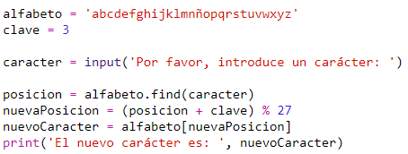
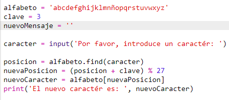
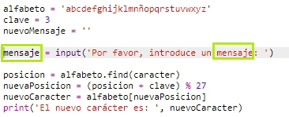
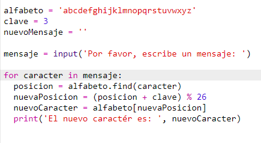
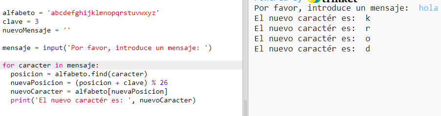

## Encriptar mensajes completos

¡En vez de encriptar y desencriptar mensajes solo letra a letra, cambiemos el programa para encriptar mensajes completos!

+ En primer lugar, comprueba que tu código es así:
    
    

+ Crea una variable para almacenar el nuevo mensaje encriptado.
    
    

+ Cambia tu código para almacenar el mensaje completo del usuario y no solo un carácter.
    
    

+ Añade un bucle `for` a tu código e indenta el resto del código para que este se repita con cada carácter del mensaje.
    
    

+ Prueba tu código. Deberías ver que cada carácter del mensaje esta encriptado y visualizado individualmente.
    
    

+ Agreguemos cada carácter cifrado a tu variable `nuevoMensaje`.
    
    

+ Puedes imprimir (`print`) el `nuevoMensaje` mientras está siendo encriptado.
    
    

+ Si borras los espacios delante del comando `print`, el mensaje encriptado solo se visualizará una vez al final. También puedes borrar el código para imprimir las posiciones del carácter.
    
    