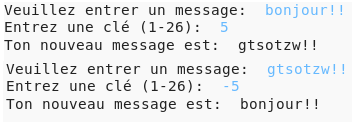

## Introduction:

Dans ce projet, tu apprendras à créer ton propre programme de cryptage, pour envoyer et recevoir des messages secrets avec un ami. Ce projet s'inscrit dans l'activité "Terre à Principia" à la page 16 du journal de l'espace.

<div class="trinket">
  <iframe src="https://trinket.io/embed/python/36801fa373?outputOnly=true&start=result" width="600" height="500" frameborder="0" marginwidth="0" marginheight="0" allowfullscreen>
  </iframe>
  
</div>

### Informations complémentaires pour les responsables de club

Si vous avez besoin d'imprimer ce projet, merci d'utiliser la [Version imprimable](https://projects.raspberrypi.org/fr-FR/projects/secret-messages/print).

--- collapse ---
---
title: Notes pour le responsable de club
---

## Introduction:

Dans ce projet, les enfants apprendront à créer un programme de cryptage, pour envoyer et recevoir des messages secrets avec un ami. Ce projet introduit l'itération (boucle) sur une chaîne de texte.

## Ressources en-ligne

**Ce projet utilise Python 3.** Nous recommandons l'utilisation de [Trinket](https://trinket.io/) pour écrire du code Python en-ligne:

* [Nouveau Trinket Python (vide) -- trinket.io/python/b77c089d40](https://trinket.io/python/b77c089d40)

Il existe aussi un trinket qui contient le projet terminé:

* ['Messages secrets' Terminé - trinket.io/python/36801fa373](https://trinket.io/python/36801fa373)

* [‘Calculatrice d'amitié’ terminé -- trinket.io/python/80799dac2c](https://trinket.io/python/80799dac2c)

## Ressources hors-ligne

Ce projet peut être [terminé hors-ligne](https://www.codeclubprojects.org/en-GB/resources/python-working-offline/) si désiré.

Vous pouvez aussi trouver une version terminée du projet dans la section "Ressources du bénévole" qui contient:

* messages-finished/messages.py
* messages-finished/friends.py

(Toutes les ressources ci-dessus peuvent aussi être téléchargées dans les fichiers `.zip` projet et bénévole)

## Objectifs d'apprentissage

* Itération (boucle) sur une variable de chaîne;
* La méthode `find()`;
* L'opérateur de module (`%`).

Ce projet traite les éléments suivants du [Programme Raspberry Pi de Création Numérique](http://rpf.io/curriculum):

* [Combiner des constructions de programmation pour résoudre un problème.](https://www.raspberrypi.org/curriculum/programming/builder)

## Défis

* Utilisez un code de César - crypter et décrypter les lettres et les mots manuellement;
* Clés variables - permettant à l'utilisateur d'entrer une clé choisie;
* Crypter et décrypter des messages - crypter et décrypter des messages entiers;
* Calculatrice d'amitié - application d'itération de texte à un nouveau problème.

## Foire aux questions

* Lors de la recherche avec `find()` ou `if char in alphabet` Notez que les recherches sont sensibles à la casse. Les enfants peuvent utiliser:
    
    ```python
    message = input("S'il vous plaît entrer un message à chiffrer:").lower()
    ```
    
    pour faire la saisie en minuscule avant de chercher.
 
--- /collapse ---

--- collapse ---
---
title: Matériels pour le projet
---

## Ressources du projet

* [Fichier .zip contenant toutes les ressources du projet](resources/secret-messages-project-resources.zip)
* [Trinket Python en-ligne vierge](https://trinket.io/python/b77c089d40)
* [Fichier Python hors-ligne vierge](resources/new-new.py)

## Ressources pour le responsable de club

* [Fichier .zip contenant toutes les ressources du projet terminé](resources/secret-messages-volunteer-resources.zip)
* [Projet Trinket en ligne terminé](https://trinket.io/python/36801fa373)
* [secret-messages-finished/messages.py](resources/secret-messages-finished-messages.py)
* [Défi de la 'calculatrice d'amitié' en ligne terminé](https://trinket.io/python/80799dac2c)
* [défi de la 'calculatrice d'amitié' hors-ligne terminé](resources/friendship-calculator-finished-friends.py)

--- /collapse ---