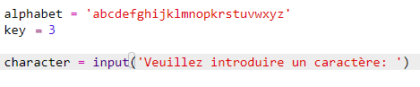
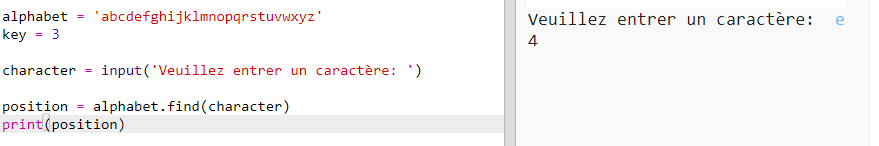
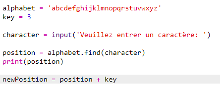
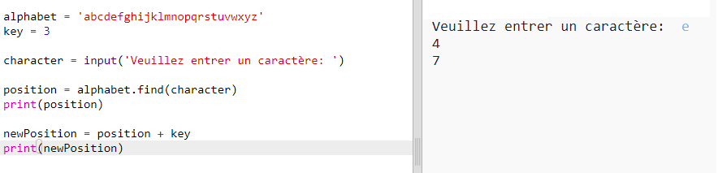
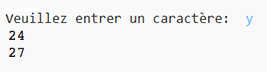
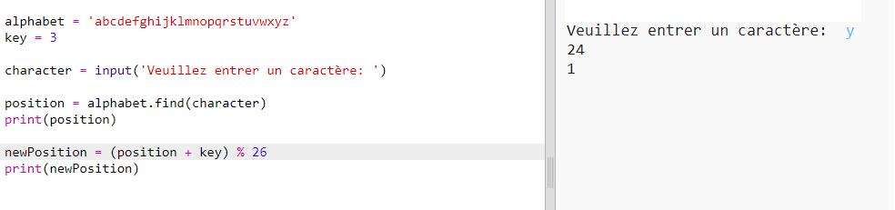
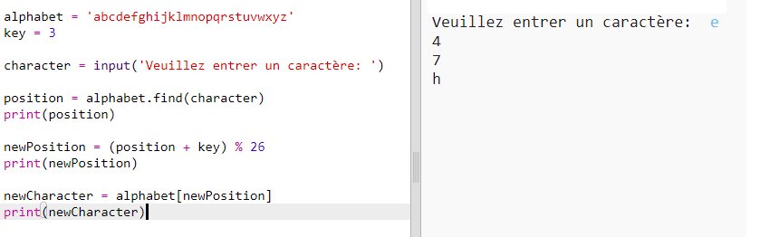
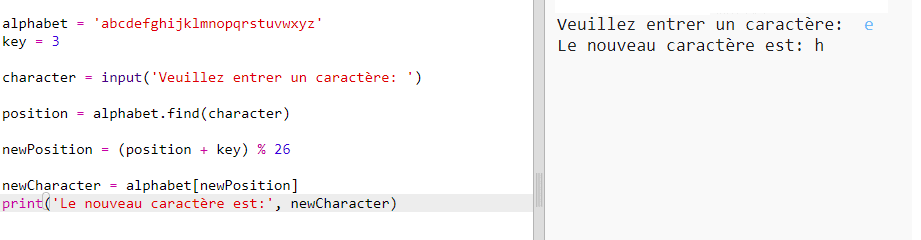

## Crypter des lettres

Écrivons un programme Python pour crypter un seul caractère.

+ Ouvre le modèle de Trinket Python vierge: <a href="https://trinket.io/python/b77c089d40" target="_blank">trinket.io/python/b77c089d40</a>.

+ Au lieu de dessiner l'alphabet dans un cercle, écrivons-le comme une variable `alphabet`.
    
    

+ Chaque lettre de l'alphabet a une position, commençant à la position 0. La lettre "a" est donc à la position 0 de l'alphabet et "c" est à la position 2.
    
    

+ Tu peux recevoir une lettre de ta variable `alphabet` en écrivant la position entre crochets.
    
    
    
    Tu peux supprimer les déclarations `print` une fois que tu as essayé cela.

+ Ensuite, tu devras stocker la `clé` secrète dans une variable.
    
    

+ Ensuite, demande à l'utilisateur une seule lettre (appelée `character`s) pour crypter.
    
    

+ Trouve la `position` du `caractère`.
    
    

+ Tu peux tester la `position` enregistrée en l'imprimant. Par exemple, le caractère "e" est à la position 4 de l'alphabet.
    
    

+ Pour crypter le `caractère` , tu dois ajouter la `clé` à la `position`. Ceci est ensuite stocké dans une variable `newPosition`.
    
    

+ Ajoute du code pour imprimer la nouvelle position du caractère.
    
    

+ Teste ton nouveau code. Tant que la `clé` vaut 3, il faut ajouter 3 à la `position` et le stocker dans ta variable `newPosition`.
    
    Par exemple, la lettre 'e' se trouve à la position 4. Pour crypter, tu ajoutes la `clé` (3), donnant 7.
    
    

+ Que se passe-t-il lorsque tu essaies de crypter la lettre 'y'?
    
    
    
    Note comment la `newPosition` est 27, et il n'y a pas 27 lettres dans l'alphabet!

+ Tu peux utiliser un `% ` pour indiquer à la nouvelle position de revenir à la position 0 une fois arrivée à la position 26.
    
    

+ Enfin, tu souhaites imprimer la lettre à la nouvelle position.
    
    Par exemple, l'ajout de la clé à la lettre "e" donne 7 et la lettre à la position 7 de l'alphabet est "h".
    
    

+ Essaie ton code. Tu peux également supprimer certaines de tes instructions d'impression, en imprimant simplement le nouveau caractère à la fin.
    
    