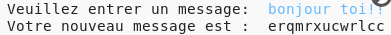
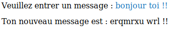

## Caractères supplémentaires

Certains caractères ne sont pas dans l'alphabet, ce qui provoque une erreur.

+ Teste ton code avec des caractères qui ne sont pas dans l'alphabet.
    
    Par exemple, tu peux utiliser le message `salut toi !!`.
    
    
    
    Note que l’espace et les caractères `!` sont tous cryptés sous la lettre 'c'!

+ Pour résoudre ce problème, tu ne veux traduire un caractère que s'il est dans l'alphabet. Pour ce faire, ajoute une déclaration `if`à ton code, et indenter le reste de ton code.
    
    

+ Teste ton code avec le même message. Que se passe-t-il cette fois?
    
    
    
    Maintenant, ton code ignore tout caractère si ce n'est pas dans l'alphabet.

+ Ce serait mieux si ton code ne cryptait rien qui ne soit pas dans l'alphabet, mais utilisait simplement le caractère original.
    
    Ajoute une déclaration `else` à ton code, qui ajoute simplement le caractère original au message crypté.
    
    

+ Teste ton code. Tu devrais voir que tous les caractères de l'alphabet sont cryptés, mais que tous les autres caractères restent seuls!
    
    