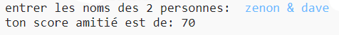
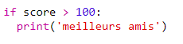

--- challenge ---

## Défi: calculatrice d'amitié

Écris un programme montrant la compatibilité de deux personnes en calculant un score d'amitié.

Le programme peut parcourir chacun des caractères des 2 noms et ajouter des points à une variable `score` à chaque fois que certaines lettres sont trouvées.

Tu devrais décider des règles d'attribution des points. Par exemple, tu peux attribuer des points aux voyelles ou aux caractères figurant dans le mot "ami":

Tu peux également donner à l'utilisateur un message personnalisé, basé sur son score:

--- /challenge ---

**Traduction de la communauté**

Ce projet a été traduit par **Jonathan Vannieuwkerke** et vérifié par **Michel Arnols**.

Nos incroyables bénévoles de traduction nous aident à donner aux enfants du monde entier la chance d'apprendre à coder. Vous pouvez nous aider à atteindre plus d'enfants en traduisant nos projets - en savoir plus sur [rpf.io/translate](https://rpf.io/translate).