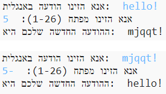

## מבוא:

בפרויקט זה תלמדו איך ליצור תוכנת הצפנה משלכם, כדי שתוכלו לשלוח ולקבל הודעות סודיות מחברים. פרויקט זה מתקשר עם הפעילות "Earth to Principia" בעמוד 16 ב-Space Diary.

<div class="trinket">
  <iframe src="https://trinket.io/embed/python/f5b9aad87b?outputOnly=true&start=result" width="600" height="500" frameborder="0" marginwidth="0" marginheight="0" allowfullscreen>
  </iframe>
  
</div>

### מידע נוסף למדריכי מועדונים

אם אתם צריכים להדפיס את הפרויקט הזה, אנא השתמשו ב[גרסה ידידותית למדפסת](https://projects.raspberrypi.org/he-IL/projects/secret-messages/print).

--- collapse ---
---
title: הערות למדריכי מועדונים
---

## מבוא:

בפרויקט זה הילדים ילמדו איך ליצור תוכנת הצפנה, כדי שיוכלו לשלוח ולקבל הודעות סודיות מחברים. פרויקט זה בא להציג את מושג האיטרציה (חזרה) על מחרוזת טקסט.

## משאבים מקוונים

**פרויקט זה משתמש ב-Python 3.** אנו ממליצים להשתמש ב-[Trinket](https://trinket.io/) כדי לכתוב ב-Python בדפדפן. פרויקט זה משתמש ב-Trinket-ים הבאים:

* [Trinket חדש (ריק) ב-Python -- jumpto.cc/python-new](http://jumpto.cc/python-new)

יש גם Trinket-ים שמכילים את הפרויקטים המוגמרים:

* ['הודעות סודיות' גמור - trinket.io/python/402256078c](https://trinket.io/python/f5b9aad87b)

* ['מחשבון חברות' גמור - trinket.io/python/2e852cd687](https://trinket.io/python/d197048e74)

## משאבים לא מקוונים

אם ברצונכם לעשות זאת, ניתן ל[השלים באופן לא מקוון](https://www.codeclubprojects.org/en-GB/resources/python-working-offline/) את הפרויקט.

אפשר למצוא את הפרויקטים המוגמרים בסעיף 'משאבים למתנדבים', שמכיל:

* messages-finished/messages.py
* messages-finished/friends.py

(כל המשאבים לעיל ניתנים להורדה גם כפרויקט וגם כקובצי `.zip` של מתנדבים.)

## מטרות למידה

* איטרציה (חזרה) על משתנה מסוג מחרוזת;
* הפונקציה `find()`;
* האופרטור מודולו (`%`).

פרויקט זה מכסה אלמנטים מהנושאים הבאים ב[תוכנית הלימודים הדיגיטלית של Raspberry Pi](https://rpf.io/curriculum):

* [שילוב מבני תוכנה לפיתרון בעיות.](https://www.raspberrypi.org/curriculum/programming/builder)

## אתגרים

* השתמשו בצופן קיסר - הצפנה ופענוח של אותיות ומילים באופן ידני;
* מפתח משתנה - מאפשרים למשתמש להזין מפתח להצפנה;
* הצפנה ופענוח של הודעות - הצפנה ופענוח של הודעות שלמות;
* מחשבון חברות - שימוש באיטרציות על טקסט בשביל בעיה חדשה.

## שאלות נפוצות

* כאשר מחפשים בעזרת `find()` או `if char in alphabet:`, יש לשים לב שהחיפושים תלויי-רישיות (תלויים בסוג האותיות באנגלית - גדולות או קטנות). הילדים יכולים להשתמש ב:
    
    ```python
    message = input("אנא הזינו הודעה להצפנה: ").lower()
    ```
    
    כדי להפוך את הקלט לאותיות קטנות לפני החיפוש.

--- /collapse ---

--- collapse ---
---
title: חומרים לפרויקט
---

## משאבים לפרויקט

* [קובץ .zip המכיל את כל משאבי הפרויקט](resources/secret-messages-project-resources.zip)
* [Trinket מקוון ריק של Python](http://jumpto.cc/python-new)
* [קובץ Python לא מקוון ריק](resources/new-new.py)

## משאבים למדריכי מועדונים

* [קובץ .zip המכיל את כל משאבי הפרויקט המוגמרים](resources/secret-messages-volunteer-resources.zip)
* [פרויקט Trinket מוגמר באופן מקוון](https://trinket.io/python/f5b9aad87b)
* [secret-messages-finished/messages.py](resources/secret-messages-finished-messages.py)
* [האתגר 'מחשבון חברות' מוגמר באופן מקוון](https://trinket.io/python/d197048e74)
* [האתגר 'מחשבון חברות' מוגמר באופן לא מקוון](resources/friendship-calculator-finished-friends.py)

--- /collapse ---