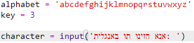
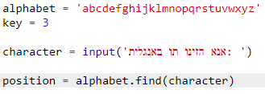
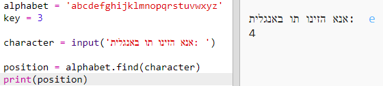
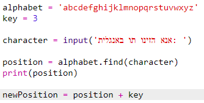
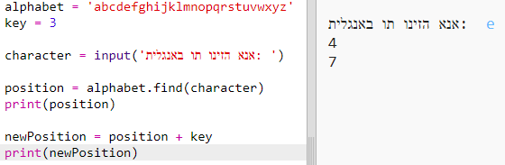
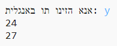
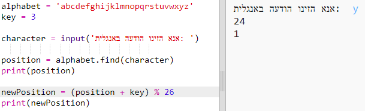
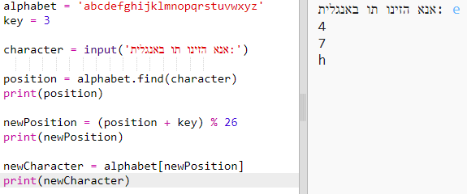
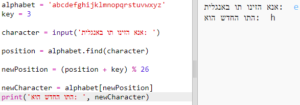

## הצפנת אותיות

בואו נכתוב תוכנית Python שמצפינה תו אחד.

+ פתחו את תבנית ה-Trinket הריקה של קובץ Python: <a href="http://jumpto.cc/python-new" target="_blank"> jumpto.cc/python-new </a>.

+ במקום לצייר את האלף-בית במעגל, נכתוב אותו כמשתנה `alphabet`.
    
    

+ לכל אות באלף-בית יש מיקום, החל מהמיקום 0. האות 'a' נמצאת במיקום 0 של האלף-בית, ו-'c' נמצאת במיקום 2.
    
    

+ אפשר לקבל אות מהמשתנה `alphabet` על ידי כתיבת המיקום בסוגריים מרובעים.
    
    
    
    אתם יכולים למחוק את ה- `print`-ים שהוספתם אחרי שניסיתם את זה.

+ לאחר מכן, נצטרך לשמור את ה-`key` (המפתח) במשתנה.
    
    

+ בשלב הבא, בקשו מהמשתמש אות יחידה (נקראת גם `character` - תו) להצפנה.
    
    

+ מצאו את המיקום (`position`) של התו (`character`).
    
    

+ אתם יכולים לבדוק את ה-`position` המאוחסן על ידי הדפסה למסך. למשל, לבדוק שהאות 'e' היא במיקום ה-4 באלף-בית.
    
    

+ כדי להצפין את ה-`character`, אתם צריכים להוסיף את ה-`key` ל-`position`. לאחר מכן התו הזה מאוחסן במשתנה `newPosition`.
    
    

+ הוסיפו קוד להדפסת התו החדש למסך.
    
    

+ בדקו את הקוד החדש שלכם. מכיוון שה-`key` שלכם הוא 3, זה אמור להוסיף 3 ל-`position` ולאחסן את התו במשתנה `newPosition`.
    
    לדוגמה, האות 'e' היא במיקום 4, כדי להצפין אותה, צריך להוסיף את המפתח (3) - מה שנותן 7.
    
    

+ מה קורה כשמנסים להצפין את האות 'y'?
    
    
    
    שימו לב שה-`newPosition` הוא 28, ואין 28 אותיות באלף-בית!

+ אתם יכולים להשתמש ב-`%` כדי להגיד למיקום החדש לחזור ל-0 כשהוא מגיע ל-26.
    
    

+ בסופו של דבר, אתם רוצים להדפיס למסך את האות שנמצאת במיקום החדש.
    
    למשל, הוספת המפתח לאות 'e' נותן 7, והאות במיקום 7 באלף-בית היא 'h'.
    
    

+ נסו את הקוד שלכם. אתם יכולים למחוק חלק מה-print-ים בתוכנית, כך שרק התו החדש יודפס.
    
    