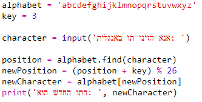
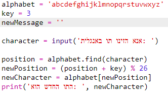
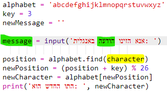
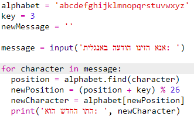
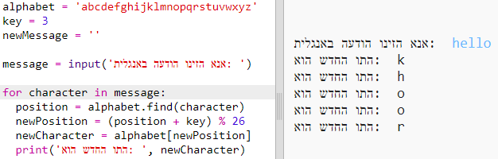
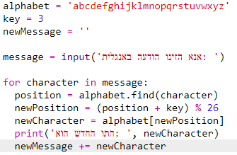
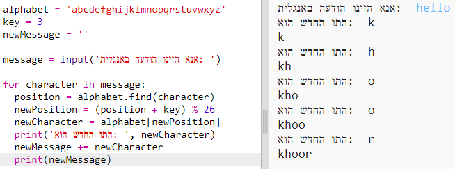
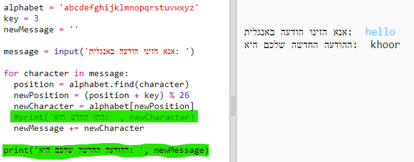

## הצפנת הודעות שלמות

במקום להצפין ולפענח תו אחד בכל פעם, בואו נשנה את התוכנית כך שהיא תוכל להצפין הודעות שלמות!

+ ראשית, בדקו שהקוד שלכם נראה כך:
    
    

+ צרו משתנה שיאחסן את ההודעה המוצפנת החדשה.
    
    

+ שנו את הקוד כך שיאחסן את כל ההודעה של המשתמש ולא רק תו אחד.
    
    

+ הוסיפו לולאת `for` לקוד, והוסיפו הזחה (אידנטציה) לשאר הקוד כדי שהוא יעשה זאת על כל תו בהודעה.
    
    

+ הריצו בדיקות על הקוד, אתם אמורים לראות שכל תו בהודעה מוצפן ומודפס למסך, אחד בכל שורה.
    
    

+ בואו נוסיף כל תו מוצפן למשתנה `newMessage`.
    
    

+ אתם יכולים להדפיס את `newMessage` בזמן שהיא עוברת הצפנה.
    
    

+ אם תמחקו את ההזחה שלפני הפקודה `print`, ההודעה המוצפנת תוצג רק פעם אחת בסוף. אתם יכולים גם למחוק את הקוד שמדפיס את התווים שהוצפנו.
    
    