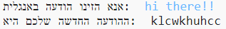
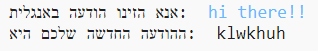
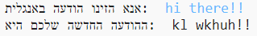

## תווים נוספים

חלק מהתווים לא נמצאים באלף-בית, מה שיגרום לשגיאה.

+ בדקו את הקוד שלכם עם תווים שלא נמצאים באלף-בית.
    
    למשל, אתם יכולים להשתמש בהודעה `hi there!!`.
    
    
    
    שימו לב שהרווח והתווים `!` הוצפנו כאות 'c'!

+ כדי לתקן את זה, אתם רוצים לתרגם תו רק אם הוא נמצא באלף-בית. כדי לעשות זאת, הוסיפו `if` לקוד, והוסיפו הזחה לשאר הקוד.
    
    

+ בדקו את התוכנית שלכם עם אותה הודעה, מה קרה הפעם?
    
    
    
    עכשיו, הקוד שלכם פשוט מדלג על כל תו שלא נמצא באלף-בית.

+ זה יהיה הרבה יותר טוב אם הקוד שלכם לא יצפין שום דבר שלא באלף-בית, ופשוט ישתמש בתו המקורי.
    
    הוסיפו `else` לקוד, שמוסיף את התו המקורי להודעה המוצפנת.
    
    

+ הריצו בדיקות על הקוד שלכם. אתם אמורים לראות עכשיו שכל תו באלף-בית מוצפן, אבל כל התווים האחרים נותרים בלי שינוי!
    
    