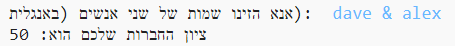
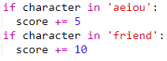
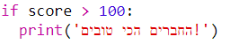

\--- challenge \---

## אתגר: מחשבון חברות

כתבו תוכנית שמציגה כמה 2 אנשים תואמים אחד לשני על ידי חישוב ציון חברות.

התוכנה יכולה לעבור על התווים שבשני השמות ולהוסיף נקודות למשתנה `score` בכל פעם שאותיות מסוימות נמצאות.

כדאי שתחליטו על כללים להענקת נקודות. למשל, אתם יכולים לתת נקודות לאותיות ניקוד, או לתווים שנמצאים במילה "friend":

אתם יכולים גם להביא למשתמש הודעה מותאמת אישית, על סמך הציון:

\--- /challenge \---