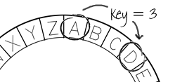

## Cezarova šifra

Šifra je vrsta tajnog kôda gdje se slova međusobno zamjenjuju tako da nitko ne može pročitati tvoju poruku.

Koristit ćeš jedan od najstarijih načina šifriranja, **Cezarovu šifru**, koji je nazvan po Juliju Cezaru.

Prije nego započnemo s kodiranjem, pokušajmo sakriti riječ koristeći Cezarovu šifru.

+ Skrivanje riječi naziva se **enkripcija**.
    
    Započnimo sa šifriranjem slova 'a'. Nacrtat ćemo englesku abecedu u krugu kako bi sakrili slovo:
    
    

+ Da bi od običnog slova napravio tajno šifrirano slovo, moraš imati tajni ključ. Koristit ćemo broj 3 kao tajni ključ (ali možeš koristiti bilo koji broj).
    
    Za **enkripciju** slova 'a', pomakni se za tri slova unaprijed, u smjeru kazaljke na satu. Tako ćeš dobiti slovo 'd':
    
    

+ Iskoristi naučeno i šifriraj riječ. Primjerice, kada šifriramo riječ 'hello' dobit ćemo 'khoor'. Pokušaj!
    
    + h + 3 = **k**
    + e + 3 = **h**
    + l + 3 = **o**
    + l + 3 = **o**
    + o + 3 = **r**

+ Vraćanje teksta u početni oblik naziva se **dekripcija**. Za dešifriranje riječi jednostavno oduzmi tajni ključ od slova umjesto da ga dodaš:
    
    + k - 3 = **h**
    + h - 3 = **e**
    + o - 3 = **l**
    + o - 3 = **l**
    + r - 3 = **o**