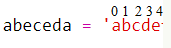
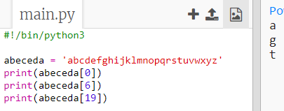
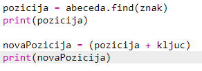

## Šifriranje slova

Napišimo Python program za šifriranje jednog znaka.

+ Otvori prazan Python predložak u Trinketu: <a href="http://jumpto.cc/python-new" target="_blank">jumpto.cc/python-new</a>.

+ Umjesto crtanja abecede u krugu, definirajmo ju kao varijablu `abeceda`.
    
    

+ Svako slovo abecede ima svoju poziciju, počevši od 0. Dakle, slovo 'a' je na nultoj poziciji abecede, a slovo 'c' na poziciji 2.
    
    

+ Za ispis slova koje se nalazi u varijabli `abeceda`, upiši poziciju tog slova unutar uglatih zagrada.
    
    
    
    Možeš izbrisati `print` naredbe nakon što si testirao kôd.

+ Zatim moraš spremiti tajni `ključ` u varijablu.
    
    

+ Sada pitaj korisnika da unese jedno slovo (odnosno `znak`) koji će se šifrirati.
    
    

+ Pronađi `poziciju` tog `znaka`.
    
    

+ Ispiši spremljenu `poziciju` kako bi ju testirao. Primjerice, testiraj je li znak 'e' na poziciji 4 u abecedi.
    
    

+ Dodaj `ključ` `poziciji` za šifriranje `znaka`. Zatim to spremi u varijablu `novaPozicija`.
    
    

+ Dodaj kôd kojim ćeš ispisati novu poziciju znaka.
    
    

+ Testiraj svoj novi kôd. S obzirom da je tvoj `ključ` broj 3, `poziciji` bi se trebao dodati broj 3, a zatim se spremiti u varijablu `novaPozicija`.
    
    Primjerice, slovo 'e' je na poziciji 4. Kako bi se slovo šifriralo, poziciji se dodaje `ključ` (3) i naposljetku dobije 7.
    
    

+ Što se dogodi kada pokušaš šifrirati slovo 'y'?
    
    
    
    Primjećuješ li da je `novaPozicija` 27, a u engleskoj abecedi nema 27 slova!

+ Ako upišeš `%` nova pozicija će se, nakon što dođe do pozicije 26, vratiti na poziciju 0.
    
    

+ Konačno, sada ćeš ispisati slovo koje se nalazi na novoj poziciji.
    
    Primjerice, kada dodamo ključ slovu 'e' dobit ćemo 7, a slovo koje se nalazi na poziciji 7 u abecedi je 'h'.
    
    

+ Isprobaj svoj kôd. Možeš i ukloniti neke od print naredbi i ispisati samo novi znak na kraju.
    
    