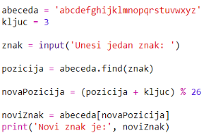
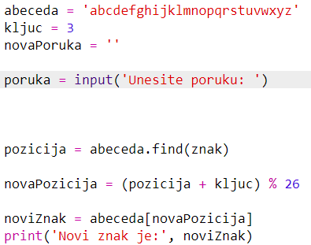

## Šifriranje poruka

Podesimo program da šifrira cijele poruke, umjesto da šifrira i dešifrira jedan po jedan znak!

+ Prvo provjeri izgleda li tvoj kôd ovako:
    
    

+ Kreiraj varijablu u koju ćeš spremiti svoju novu šifriranu poruku.
    
    

+ Izmijeni kôd tako da sprema korisnikovu poruku, a ne samo jedan znak.
    
    

+ Svom kôdu dodaj `for` petlju, a zatim uvuci ostatak kôda kako bi se ponavljao za svaki znak poruke.
    
    

+ Testiraj kôd. Svaki znak poruke trebao bi se šifrirati i ispisivati jedan po jedan.
    
    

+ Dodajmo svaki šifrirani znak u varijablu `novaPoruka`.
    
    

+ Naredbom `print` možeš ispisati varijablu `novaPoruka` dok se šifrira.
    
    

+ Izbrišeš li prazna mjesta prije naredbe `print`, šifrirana poruka će se ispisati samo jednom na kraju. Možeš izbrisati i dio kôda koji ispisuje pozicije znakova.
    
    