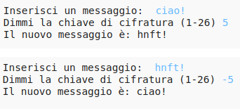

## Introduzione:

In questo progetto, imparerai a creare il tuo programma di criptaggio per mandare e ricevere messaggi con un amico. Questo progetto è connesso con l'attività "Terra a Principia" a pagina 16 del Diario Spaziale.

<div class="trinket">
  <iframe src="https://trinket.io/embed/python/402256078c?outputOnly=true&start=result" width="600" height="500" frameborder="0" marginwidth="0" marginheight="0" allowfullscreen>
  </iframe>
  
</div>

## Risorse online

__Questo progetto utilizza Python 3.__ È consigliabile utilizzare [trinket](https://trinket.io/) per scrivere in linguaggio Python online. Questo progetto contiene i seguenti Trinket:

+ [Trinket di Python nuovo (vuoto) -- jumpto.cc/python-new](http://jumpto.cc/python-new)

È presente anche un trinket che contiene il progetto completato:

+ [Messaggi Segreti - Finito -- trinket.io/python/402256078c](https://trinket.io/python/402256078c)

+ [Calcolatore di Amicizia - Finito -- trinket.io/python/2e852cd687](https://trinket.io/python/2e852cd687)

## Risorse offline
Questo progetto può essere completato [offline](https://www.codeclubprojects.org/en-GB/resources/python-working-offline/) se preferito.

Una versione completa di questo progetto è presente anche nella sezione "Risorse per i volontari", che contiene:

+ messages-finished/messages.py
+ messages-finished/friends.py

(Tutte le risorse sopra indicate possono essere scaricate anche come file ".zip" di progetto e di volontario)

## Obiettivi di apprendimento
+ Iterazione (loop) su una variabile di stringa;
+ Il metodo `find()`;
+ L'operatore di modulo (`%`).

Questo progetto copre elementi contenuti nei seguenti filoni di [Raspberry Pi Digital Making Curriculum](http://rpf.io/curriculum):

+ [Combinazione di costrutti di programmazione per la soluzione di problemi.](https://www.raspberrypi.org/curriculum/programming/builder)

## Sfide
+ Usa il codice cifrato Cesare - cripta e decripta manualmente lettere e parole;
+ Chiavi variabili - permette all'utente di inserire una chiave a scelta;
+ Cripta e decripta messaggi - criptare e decriptare interi messaggi;
+ Calcolatore di amicizia - applica l'iterazione di testo a un nuovo problema.

## Domande frequenti
+ Facendo una ricerca usando 'find()` o `if char in alphabet:`, nota che le ricerche distinguono tra maiuscole e minuscole. I bambini possono usare:

	```python
	message = input("Inserire un messaggio da criptare: ").lower()
	```

	in modo che l'input sia in lettere minuscole prima di iniziare la ricerca.