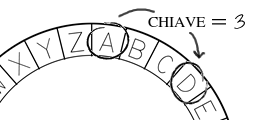

## Il cifrario di Cesare

Un cifrario è un tipo di codice segreto in cui si cambiano le lettere in modo che nessuno possa comprendere il messaggio.

Utilizzerai uno dei cifrari più vecchi e famosi, il **cifrario di Cesare**, che prende il nome da Giulio Cesare.

Prima di iniziare il codice, proviamo ad usare il cifrario di Cesare per mascherare una parola.

+ L'operazione di mascherare una parola è detta **crittografia**.
    
    Iniziamo con la crittografia della lettera 'a'. Per farlo, possiamo disegnare l'alfabeto in un cerchio, come questo:
    
    

+ Per creare una lettera crittografata segreta a partire da una normale è necessario disporre di una chiave segreta. Usiamo il numero 3 come chiave (ma puoi usare qualsiasi numero che ti piaccia).
    
    Per **criptare** la lettera 'a', basta che ti sposti di 3 lettere in senso orario per ottenere la lettera 'd':
    
    

+ Puoi usare ciò che hai imparato per criptare un'intera parola. Ad esempio, "hello" criptato è "khoor". Prova tu stesso.
    
    + h + 3 = **k**
    + e + 3 = **h**
    + l + 3 = **o**
    + l + 3 = **o**
    + o + 3 = **r**

+ Il ritorno al testo normale si chiama **decrittografia**. Per decriptare una parola, basta sottrarre la chiave invece di aggiungerla:
    
    + k - 3 = **h**
    + h - 3 = **e**
    + o - 3 = **l**
    + o - 3 = **l**
    + r - 3 = **o**