## Criptare lettere

Scriviamo un programma Python per criptare un singolo carattere.

+ Apri il modello vuoto di Python Trinket: <a href="http://jumpto.cc/python-new" target="_blank">jumpto.cc/python-new</a>.

+ Invece di disegnare l'alfabeto in un cerchio, scriviamolo come una variabile 'alphabet'.

	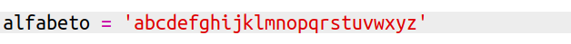

+ Ogni lettera dell'alfabeto ha una posizione, iniziando dalla posizione 0. Dunque la lettera 'a' si trova alla posizione ' dell'alfabeto, e 'c' alla posizione 2.

	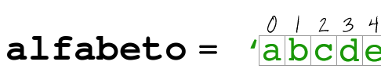

+ Puoi ottenere una lettera dalla tua variabile 'alphabet' scrivendo la posizione tra parentesi quadre.

	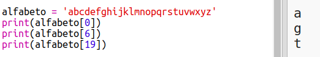

	Potrai cancellare le frasi 'print' una volta che lo avrai provato.

+ In seguito, dovrai salvare la key' segreta in una variabile.

	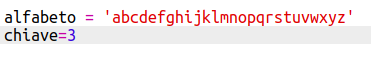

+ Poi, chiedi all'utente una lettera singola (chiamata 'characterì) da criptare.

	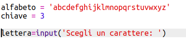

+ Trova la 'position' del 'character'.

	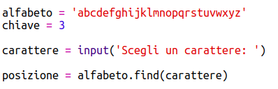

+ Puoi provare la 'position' salvata stampandola. Per esempio, quel carattere 'e' si trova alla posizione 4 nell'alfabeto.

	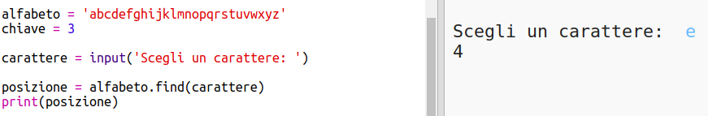

+ Per criptare il 'character', dovresti aggiungere la 'key' alla 'position'.

	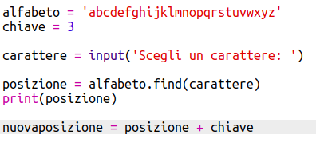

+ Prova il tuo nuovo codice. Dato che la tua 'key' è 3, dovrebbe aggiungere 3 alla 'position' e salvarla nella tua variabile 'newPosition'.

	Per esempio, la lettera 'e' si trova alla posizione 4.  Per criptare, aggiungi la 'key' (3), dando 7.

	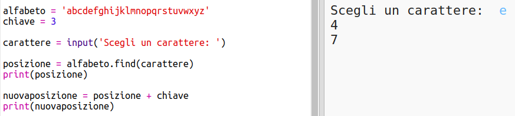

+ Cosa succede quando provi a criptare la lettera 'y'?

	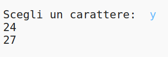

	Nota come la 'newPosition' è 27 e non ci sono 27 lettere nell'alfabeto!

+ Puoi usare un '%' per dire alla nuova posizione di tornare alla posizione 0 una volta che arriva alla posizione 26. (Questo progetto si basa sull'alfabeto inglese, che è composto da 26 lettere.)

	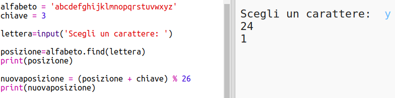

+ Per finire, stamperai la lettera alla nuova posizione.

	Per esempio, aggiungendo la chiave alla lettera 'e' dà 7 e la lettera alla posizione 7 dell'alfabeto è 'h'.

	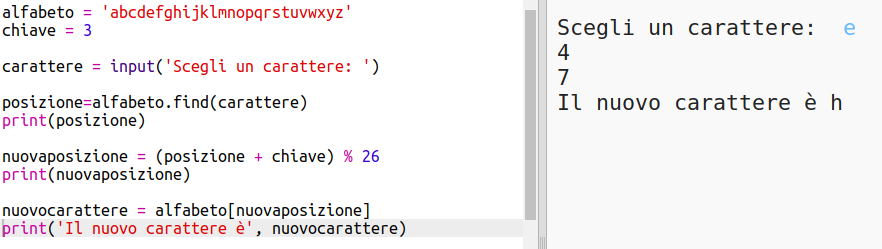

+ Prova il nuovo codice. Puoi anche rimuovere alcune delle frasi di stampa, semplicemente stampando il nuovo carattere alla fine.

	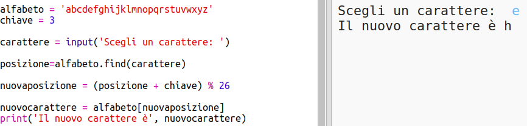
