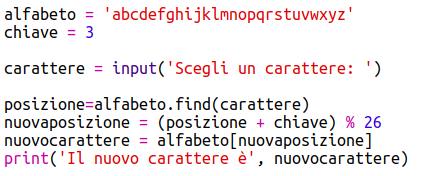
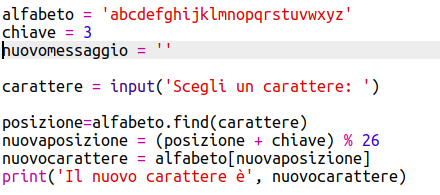
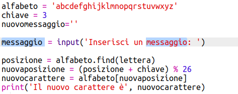
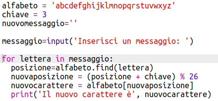
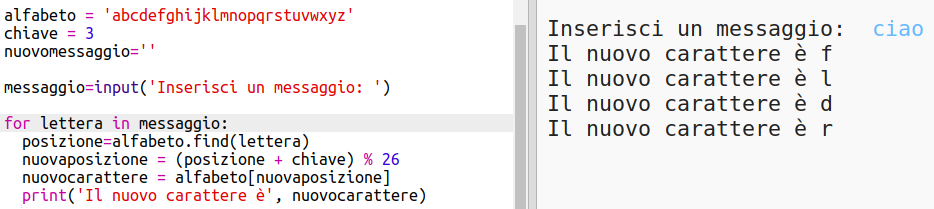
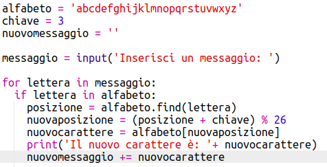
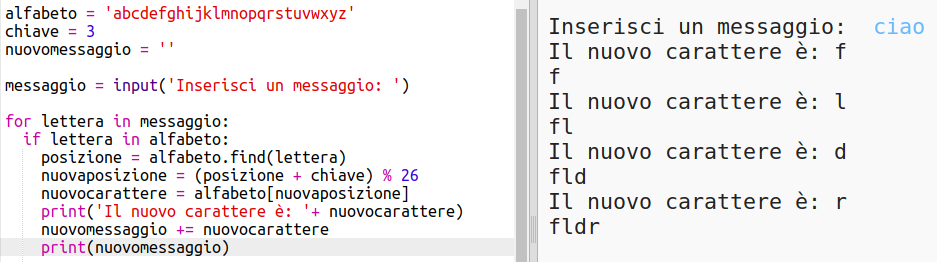
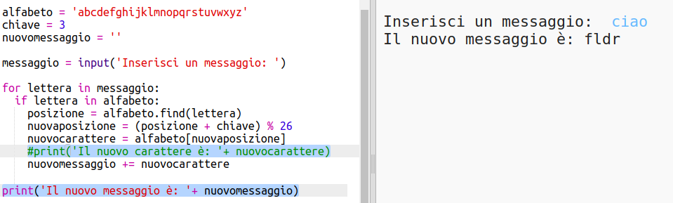

## Criptare interi messaggi

Invece di criptare e decriptare messaggi un carattere per volta, cambiamo il programma per criptare interi messaggi!

+ Per prima cosa, controlla che il tuo codice sia così:

	

+ Crea una variabile per salvare il nuovo messaggio criptato.

	

+ Cambia il tuo codice per salvare il messaggio dell'utente e non solo un carattere.

	

+ Aggiungi un loop 'for' al tuo codice e indenta il resto del codice in modo che si ripeta per ogni carattere del messaggio.

	

+ Prova il codice. Dovresti notare che ogni carattere nel messaggio è criptato e stampato uno alla volta.

	

+ Aggiungiamo ogni carattere criptato alla tua variabile 'newMessage'.

	

+ Puoi 'print' il 'newMessage' man mano che si va criptando.

	

+ Se elimini gli spazi prima della frase 'print', il messaggio criptato verra visualizzato solo una volta alla fine. Puoi anche eliminare il codice per stampare le posizioni del carattere.

	
