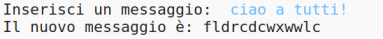
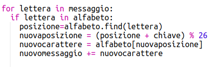
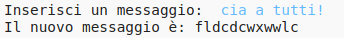
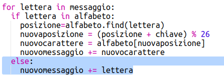
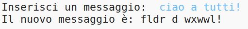

## Caratteri Extra

Alcuni caratteri non si trovano nell'alfabeto, e questo causa un errore.

+ Prova il tuo codice con alcuni caratteri che non si trovano nell'alfabeto.

	Per esempio, potresti usare il messaggio `hi there!!`.

	

	Nota che lo spazio e i caratteri '!' sono tutti criptati come la lettera 'c'!

+ Per risolverlo, tradurrai un carattere solo se si trova nell'alfabeto. Per fare ciò, aggiungi una frase 'if' al tuo codice e indenta il resto del codice.

	

+ Prova il tuo codice con lo stesso messaggio. Che succede questa volta?

	

	Ora, il tuo codice semplicemente salta tutti i caratteri che non sono nell'alfabeto.

+ Sarebbe meglio se il tuo codice non criptasse niente che non sia nell'alfabeto, ma usasse solo il carattere originale.

	Aggiungi al tuo codice una frase 'else', che semplicemente aggiunge il carattere originale al messaggio criptato.

	

+ Prova il codice. Dovresti vedere che ogni carattere nell'alfabeto è criptato, ma tutti gli altri sono lasciati in pace!

	
