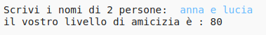
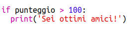

--- challenge ---
## Sfida: Calcolatore di amicizia 
Scrivi un programma per mostrare quanto sono compatibili 2 persone, calcolando un punteggio di amicizia.

Il programma potrebbe ripetersi per ogni carattere nei 2 nomi e aggiungere punti a una variabile 'score' ogni volta che vengono trovate certe lettere.

Dovresti decidere le regole per assegnare i punti. Per esempio, potresti assegnare punti per le vocali o i caratteri che sono trovati nella parola 'friend'.

Potresti anche dare all'utente un messaggio personalizzato, basato sul suo punteggio:

--- /challenge ---