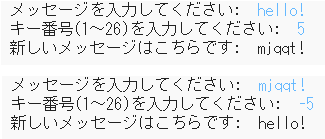

## はじめに：

このプロジェクトでは、独自の暗号化プログラムを作成し、ともだちと秘密のメッセージを送受信する方法を学びます。 このプロジェクトは、Space Diaryの16ページにある「Earth to Principia」活動と連携しています。

<div class="trinket">
  <iframe src="https://trinket.io/embed/python/9703621ab5?outputOnly=true&start=result" width="600" height="500" frameborder="0" marginwidth="0" marginheight="0" allowfullscreen>
  </iframe>
  
</div>

### クラブリーダーのための追加情報

このプロジェクトを印刷する必要がある場合は、 [印刷用バージョン](https://projects.raspberrypi.org/ja-JP/projects/secret-messages/print)を使用してください。

--- collapse ---
---
title: クラブリーダーノート
---

## はじめに：

このプロジェクトでは、子供たちは暗号化プログラムを作成する方法、ともだちと秘密のメッセージを送受信する方法を学びます。このプロジェクトでは、テキスト文字列に対しての反復（ループ）処理を紹介しています。

## オンライン・リソース

**このプロジェクトではPython 3を使用しています。**[trinket](https://trinket.io/) を使ってPythonをオンラインで書くことをお勧めします。このプロジェクトには、次のTrinketが含まれています：

* [新しい（何も書かれていない）Python Trinket - jumpto.cc/python-new](http://jumpto.cc/python-new)

完成したプロジェクトを含むtrinketもあります：

* [「秘密のメッセージ」の完成版 - trinket.io/python/9703621ab5](https://trinket.io/python/9703621ab5)

* [「なかよし計算機」の完成版 - trinket.io/python/ae877a31f4](https://trinket.io/python/ae877a31f4)

## オフライン・リソース

このプロジェクトは[オフラインで完成する](https://www.codeclubprojects.org/en-GB/resources/python-working-offline/)ことが可能です。

完成したプロジェクトは、「ボランティアリソース」セクションにあり、以下を含んでいます。

* messages-finished/messages.py
* messages-finished/friends.py

（上記のリソースはすべてプロジェクトとボランティア`.zip` ファイルとしてダウンロードすることも可能です。）

## 学習目標

* 文字列変数に対する反復（ループ）
* `find()`メソッド
* モジュラス（剰余）演算子（`%`）

このプロジェクトでは 、[Raspberry Pi デジタル・メイキング・カリキュラム](http://rpf.io/curriculum)の以下の要素をカバーしています。

* [プログラミング構造を組み合わせて問題を解決する。](https://www.raspberrypi.org/curriculum/programming/builder)

## チャレンジ

* シーザー暗号を使ってみる - 文字と単語を手動で暗号化および復号します。
* キー番号を変える - ユーザーが選択したキー番号を入力できるようにします。
* メッセージの暗号化と復号 - メッセージ全体の暗号化と復号。
* なかよし計算機 - テキスト反復処理を新しい問題に適用する。

## よくある質問

* `find()`や`if char in alphabet:`を使って文字を探す場合、大文字と小文字が区別されることに注意してください。子供たちは以下のようにすることで：
    
    ```python
    message = input("暗号化するメッセージを入力してください: ").lower()
    ```
    
    探す前に入力した文字を小文字にすることができます。

--- /collapse ---

--- collapse ---
---
title: プロジェクト資料
---

## プロジェクト資料

* [全プロジェクト資料が入った.zipファイル](resources/secret-messages-project-resources.zip)
* [オンライン上の何も入力されていないPython Trinket](http://jumpto.cc/python-new)
* [オフラインの何も入力されていないPythonファイル](resources/new-new.py)

## クラブ・リーダー向け資料

* [完成したプロジェクトの全資料が入った.zipファイル](resources/secret-messages-volunteer-resources.zip)
* [オンライン上の完成版Trinketプロジェクト](https://trinket.io/python/9703621ab5)
* [secret-messages-finished/messages.py](resources/secret-messages-finished-messages.py)
* [オンライン上のチャレンジ「なかよし計算機」完成版](https://trinket.io/python/ae877a31f4)
* [オフラインのチャレンジ「なかよし計算機」完成版](resources/friendship-calculator-finished-friends.py)

--- /collapse ---